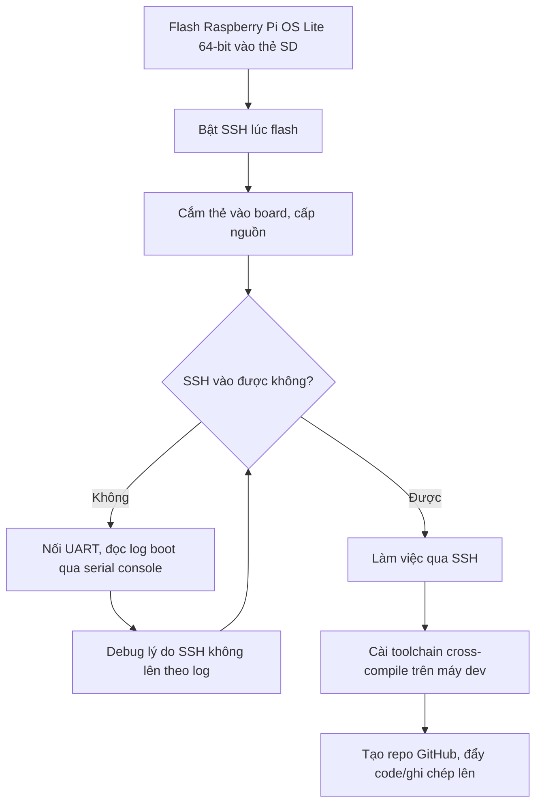

# Setup môi trường làm việc

!!! note "Mục tiêu"
    Sau bài này: board Raspberry Pi chạy Raspberry Pi OS Lite 64-bit, SSH vào được từ máy dev,
    có đường UART dự phòng khi SSH không lên được, máy dev có sẵn hai toolchain cross-compile
    (bare-metal và Linux ARM64), và một repo GitHub sẵn sàng để bắt đầu commit ghi chép.

## Chuẩn bị

- Phần cứng: Raspberry Pi — `{ĐIỀN: model, vd Pi 4B/Pi 3B+/Pi Zero 2W}`, thẻ SD, cáp USB-to-serial
  (`{ĐIỀN: model adapter, vd CP2102/FTDI FT232}`), 3 dây jumper cái-cái
- Máy dev: `{ĐIỀN: hệ điều hành máy dev — Linux/WSL/macOS, bản gì}`
- Đã cài/build trước đó: không có — đây là trang đầu tiên trong site
- Khái niệm nên đọc trước: không bắt buộc, nhưng bước cài toolchain bên dưới chỉ liệt kê lệnh cài
  đặt — muốn hiểu vì sao toolchain lại có tên dài `aarch64-linux-gnu-gcc` và bên trong gồm những
  gì thì đọc [Toolchain cross-compilation](../01-linux-nen-tang/toolchain.md)

## Sơ đồ luồng thao tác



## Các bước

### 1. Cài Raspberry Pi OS Lite 64-bit

Dùng Raspberry Pi Imager (`rpi-imager`), không cần bản Desktop vì chỉ làm việc qua SSH/UART.

1. Chọn OS: **Raspberry Pi OS Lite (64-bit)** — bản cụ thể: `{ĐIỀN: phiên bản/ngày phát hành image
   đang dùng}`
2. Chọn thẻ SD đích, bấm biểu tượng bánh răng (Advanced options) **trước khi** ghi — chỗ này cấu
   hình luôn hostname, user/password, SSH, WiFi để khỏi phải làm lại thủ công ở bước 2
3. Ghi image vào thẻ

### 2. Bật SSH

Nếu đã bật SSH ở Advanced options lúc flash thì bỏ qua bước này. Nếu chưa, cách headless (không
cắm màn hình/bàn phím): sau khi flash xong, mount lại partition boot của thẻ SD, tạo một file rỗng
tên `ssh` (không đuôi) ở thư mục gốc partition đó — Raspberry Pi OS thấy file này lúc boot đầu tiên
thì tự bật SSH daemon.

Cắm thẻ vào board, cấp nguồn, đợi boot xong rồi SSH vào:

```bash
ssh {ĐIỀN: username}@{ĐIỀN: hostname.local hoặc IP}
```

### 3. Nối UART serial console

Dùng khi bước 2 không SSH vào được (đổi mạng, sai cấu hình WiFi, lỗi boot...) — UART cho log boot
trực tiếp, không phụ thuộc mạng.

Đấu USB-to-serial adapter với header GPIO 40 chân của Pi, **chéo TX-RX, không nối chân 5V**:

| Adapter | Pi (pin) |
|---|---|
| RX | GPIO14 / TXD (pin 8) |
| TX | GPIO15 / RXD (pin 10) |
| GND | GND (pin 6) |

Mặc định Raspberry Pi OS đã bật login shell qua serial console (`enable_uart=1` trong
`config.txt`, tham số `console=serial0,115200` trong `cmdline.txt`) — không cần chỉnh gì thêm nếu
chỉ muốn xem log/đăng nhập qua UART.

Từ máy dev, mở serial console ở baud rate 115200:

```bash
screen {ĐIỀN: cổng serial trên máy dev, vd /dev/ttyUSB0 hoặc COM3} 115200
```

### 4. Cài toolchain cross-compile trên máy dev

Hai toolchain, hai mục đích khác nhau:

- `gcc-arm-none-eabi` — bare-metal, target `none` (không hệ điều hành), dùng khi viết firmware
  chạy thẳng trên MCU (Cortex-M) chứ không phải trên chính con Pi
- `gcc-aarch64-linux-gnu` — cross-compile app/kernel module chạy trên Raspberry Pi OS 64-bit
  (kiến trúc `aarch64`, target `linux`)

```bash
sudo apt install gcc-arm-none-eabi gcc-aarch64-linux-gnu
```

Nếu dùng bản tải riêng từ trang chủ ARM thay vì bản apt (thường mới hơn), ghi lại đường dẫn cài
đặt và dòng thêm vào PATH:

```
{ĐIỀN: đường dẫn toolchain trên máy, vd /opt/arm-toolchain/bin, và dòng export PATH đã thêm vào .bashrc/.zshrc}
```

### 5. Tạo repo GitHub

```bash
git init
git add docs/ mkdocs.yml
git commit -m "khung site ban đầu"
git remote add origin {ĐIỀN: URL repo GitHub, vd git@github.com:<user>/<repo>.git}
git push -u origin main
```

## Kiểm tra kết quả

```
$ ssh {ĐIỀN: user}@{ĐIỀN: host} whoami
{ĐIỀN: output thật}

$ aarch64-linux-gnu-gcc --version
aarch64-linux-gnu-gcc (...) {ĐIỀN: version thật}

$ arm-none-eabi-gcc --version
arm-none-eabi-gcc (...) {ĐIỀN: version thật}

$ git remote -v
origin  {ĐIỀN: URL repo}  (fetch)
origin  {ĐIỀN: URL repo}  (push)
```

Qua UART, thấy được log boot đầy đủ và prompt đăng nhập — đây là dấu hiệu console hoạt động kể cả
khi mạng có vấn đề, nên xem là bước kiểm tra dự phòng chứ không chỉ làm khi SSH hỏng.

!!! tip "Chèn ảnh thật của mình"
    Screenshot Raspberry Pi Imager lúc cấu hình Advanced options, hoặc log UART lúc board boot lần
    đầu, là bằng chứng setup thật — chèn vào `img/` cùng thư mục trang này.

## Mở rộng

1. Chuyển SSH sang xác thực bằng key thay vì password, tắt hẳn `PasswordAuthentication` trong
   `sshd_config` — an toàn hơn khi board để mở lâu dài trên mạng
2. Đặt DHCP reservation hoặc IP tĩnh cho Pi trên router, để hostname/IP không đổi giữa các lần boot

## Liên quan

- **Bước tiếp theo:** [Chọn phần cứng](phan-cung.md)
- **Đào sâu về toolchain:** [Toolchain cross-compilation](../01-linux-nen-tang/toolchain.md)

---
*Nội dung gốc, ghi lại từ quá trình tự setup môi trường làm việc của mình — không dịch/tham khảo
từ nguồn nào.*
