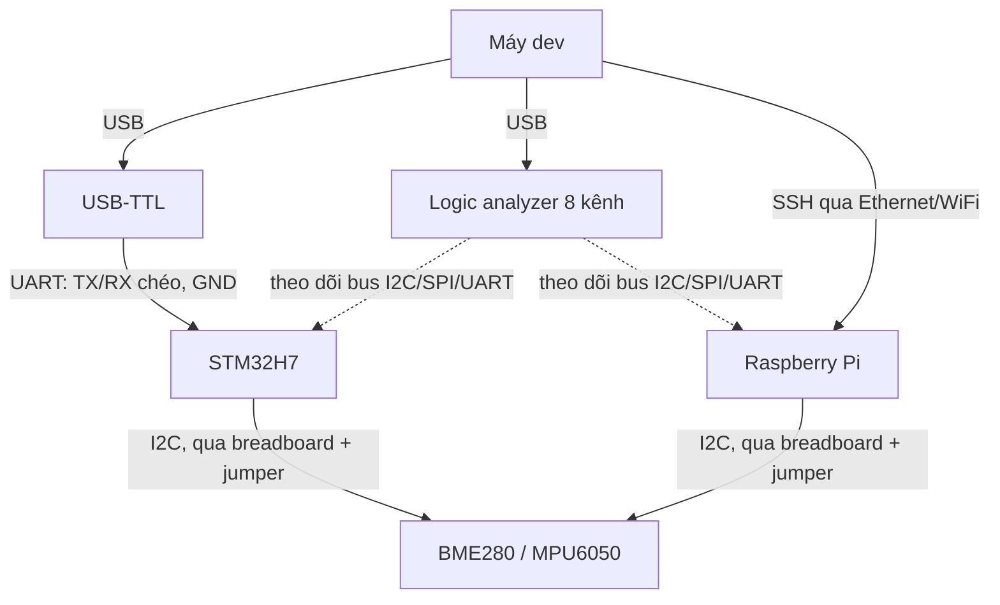

# Chọn phần cứng

!!! note "Tóm tắt"
    Bộ phần cứng chạy xuyên suốt site: một board STM32H7 cho mảng bare-metal/RTOS, một
    Raspberry Pi cho mảng Embedded Linux, và vài món đồ nghề debug nên sắm trước khi bắt đầu.

## Vì sao cần biết cái này

Mỗi lệnh, mỗi output dmesg, mỗi con số đo timing trong site này chạy trên một bộ phần cứng cụ
thể — không phải "một board ARM chung chung nào đó". Làm theo mà kết quả không khớp, biết ngay
là do khác revision/RAM hay do bug thật trong hướng dẫn. Một số bài thực hành sau này (đọc log
UART, bắt tín hiệu I2C) cũng cần sẵn đồ nghề debug tối thiểu — thiếu thì đến giữa bài phải dừng
lại đi mua, mất nhịp làm việc.

## Board chính: STM32H7

`{ĐIỀN: variant cụ thể, vd STM32H743ZI trên Nucleo-H743ZI2}`

Lõi Cortex-M7, không có MMU — không chạy được Linux kernel. Board này dùng cho mục **C &
Bare-metal** và **RTOS internals**: lập trình thanh ghi trực tiếp, viết linker script/startup
code, chạy FreeRTOS, đo context switch bằng logic analyzer. Có sẵn mạch nạp ST-Link trên board
nên không cần mua debugger rời để flash/debug qua GDB.

## Board Linux: Raspberry Pi

`{ĐIỀN: model cụ thể, vd Raspberry Pi 4 Model B 4GB}` — đã setup ở [bài trước](moi-truong.md).

Lõi Cortex-A có MMU nên chạy được Linux kernel đầy đủ. Dùng cho mục **Linux nền tảng**,
**Kernel driver**, và **Yocto & BSP**: build kernel, viết platform driver, build image bằng
Yocto/Buildroot rồi flash chạy thật thay vì chỉ chạy trên QEMU.

## Sơ đồ kết nối bench debug

Logic analyzer không đấu nối tiếp vào mạch — chỉ kẹp que đo song song vào đường tín hiệu đã có
sẵn giữa hai đầu (board và cảm biến/adapter), nên không ảnh hưởng hoạt động của bus khi đo.

!!! tip "Chèn ảnh bench setup thật"
    Ảnh chụp toàn bộ bench (board, logic analyzer, dây đấu breadboard) là nội dung gốc giá trị
    nhất — đặt vào `img/` cùng thư mục trang này, chèn bằng ``.

## Danh sách linh kiện nên mua

- **Logic analyzer 8 kênh** — bắt tín hiệu I2C/SPI/UART thật để xem timing, phân biệt lỗi do
  driver hay do phần cứng. Loại clone giá rẻ (chip Cypress FX2) dùng được với sigrok/PulseView,
  không dùng được phần mềm Saleae chính hãng — biết trước để khỏi mua nhầm kỳ vọng.
- **USB-TTL** (`{ĐIỀN: model, vd CP2102/FT232RL/CH340}`) — đọc log UART console, cách debug
  bootloader/kernel phổ biến nhất khi chưa có mạng. Đã dùng ở [bài setup môi trường](moi-truong.md).
- **Cảm biến I2C**: BME280 (nhiệt độ/áp suất/độ ẩm), MPU6050 (accelerometer/gyro) — mục tiêu thực
  hành viết I2C driver ở mục **Kernel driver**.
- **Breadboard, dây jumper** (đực-đực, đực-cái) — đấu nối nhanh không cần hàn, tháo lắp lại được
  khi đổi mạch thử nghiệm.

!!! warning "Mức điện áp logic"
    STM32H7 chỉ chịu mức 3.3V trên GPIO. Một số module USB-TTL/cảm biến mặc định ra 5V — kiểm tra
    jumper chọn mức điện áp (hoặc datasheet module) trước khi cắm, tránh cắm nhầm cháy chân GPIO.

## Liên quan

- **Đọc trước:** [Setup môi trường](moi-truong.md)
- **Đọc tiếp:** [Linh kiện điện tử cơ bản](../07-phan-cung/linh-kien.md) — vai trò từng linh kiện
  khi đọc schematic
- **Đọc tiếp:** [Toolchain cross-compilation](../01-linux-nen-tang/toolchain.md)

---
*Nội dung gốc, mô tả phần cứng thật mình dùng khi viết site này — không dịch/phóng tác từ nguồn
nào.*
