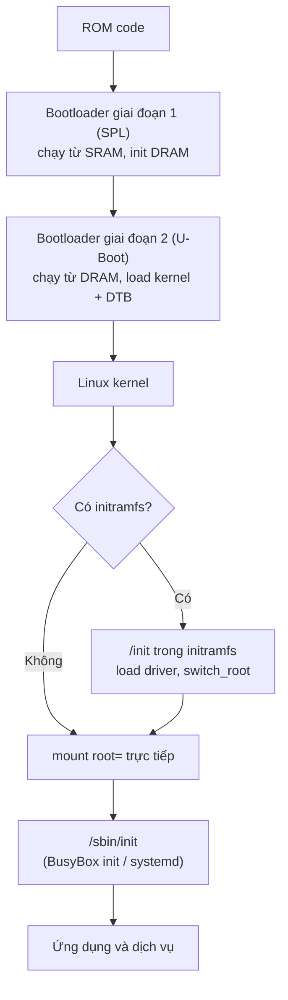

# Boot flow: từ ROM code đến init

!!! note "Tóm tắt"
    Từ lúc cắm điện đến khi có shell prompt, board đi qua một chuỗi bàn giao quyền điều khiển:
    ROM code → bootloader (thường hai giai đoạn) → kernel → (initramfs) → init/systemd. Trang
    này giải thích từng chặng và ai chịu trách nhiệm việc gì.

## Vì sao cần biết cái này

Board cắm điện, UART không in ra gì cả — lỗi ở đâu? Không nắm chuỗi boot thì debug là mò mẫm.
Nắm rõ thứ tự các chặng thì khoanh vùng được ngay: ROM code có tìm thấy bootloader không? U-Boot
có in banner không? Có dòng "Starting kernel..." không? Kernel có panic vì không mount được root
filesystem không? Mỗi câu trả lời "không" chỉ thẳng vào chặng cần xem lại. Có một trường hợp
"vô hình" không nằm gọn trong các câu hỏi trên: mọi chặng đều chạy đúng nhưng quên tham số
`console=` nên board vẫn boot bình thường, chỉ là không có gì hiện ra ở cổng UART đang cắm.

## Chặng 1 — ROM code

Hầu hết SoC có sẵn **ROM code** ghi cứng trong chip lúc sản xuất, không sửa được, hành vi mô tả
trong datasheet. Nó đọc các chân boot (ví dụ `BOOT[2:0]` trên STM32MP1) để biết tìm bootloader ở
đâu: SD card, eMMC, NAND/NOR flash, USB... Không thấy bootloader hợp lệ ở thiết bị đầu tiên, ROM
code tự chuyển sang thiết bị kế tiếp trong danh sách thay vì dừng hẳn — đây là lý do đôi khi chỉ
cần đổi vị trí cắm SD card/USB là board tự boot lại được, dù chưa đụng gì tới chân boot pin.

RAM ngoài (DRAM) lúc này **chưa được khởi tạo** — việc đó cần chính bootloader làm — nên ROM code
chỉ load được bootloader vào một vùng SRAM nội bộ nhỏ trên chip. Dung lượng SRAM giới hạn đó là
lý do bootloader trên embedded thường chia làm **hai giai đoạn**. Đa số ROM code còn có cơ chế
recovery qua UART/USB để reflash khi board chưa có bootloader hoặc bootloader hỏng.

## Chặng 2 — Bootloader hai giai đoạn

**Giai đoạn 1** (SPL — *Secondary Program Loader*, trong U-Boot) là bản rút gọn, đủ nhỏ để chạy
từ SRAM. Việc chính: khởi tạo DRAM controller, rồi load giai đoạn 2 vào DRAM.

**Giai đoạn 2** (U-Boot đầy đủ, hoặc GRUB trên x86) chạy từ DRAM nên hết giới hạn dung lượng,
có driver phong phú hơn: đọc filesystem FAT/ext4, tải qua mạng (TFTP), có shell tương tác. Việc
cuối cùng: load kernel image và Device Tree (kèm initramfs nếu có) vào RAM, đặt kernel command
line (`bootargs`, gồm `root=` chỉ định root filesystem và `console=` chỉ định cổng in log —
thiếu `console=` thì kernel vẫn chạy bình thường nhưng không in gì ra UART), rồi nhảy vào kernel
bằng lệnh boot tương ứng: `bootz kernel_addr initrd_addr fdt_addr` cho ARM32, `booti` cho
ARM64/RISC-V — không có initramfs thì thay `initrd_addr` bằng dấu `-`.

Kernel image thường dùng chung cho nhiều board khác nhau, tự nó không biết đang chạy trên phần
cứng nào — đây là lý do bắt buộc phải có Device Tree (DTB) đi kèm: nó mô tả những thứ kernel
không tự nhận diện được (bus I2C/SPI, chân GPIO, địa chỉ thanh ghi ngoại vi...) để kernel probe
đúng driver cho đúng board. U-Boot ghi `bootargs` vào node `chosen` của DTB ngay trước khi nhảy
vào kernel; ba tùy chọn kernel `CONFIG_CMDLINE_FROM_BOOTLOADER`/`CONFIG_CMDLINE_FORCE`/
`CONFIG_CMDLINE_EXTEND` quyết định dùng command line từ bootloader, từ lúc build kernel, hay nối
cả hai. Trên x86, vai trò tương đương của Device Tree là bảng **ACPI**, do BIOS/UEFI cung cấp
thay vì U-Boot.

Trên SoC ARMv8/RISC-V hiện đại còn có thêm một lớp **trusted firmware** (TF-A, OpenSBI) chạy
trước U-Boot ở mức đặc quyền cao nhất, khởi tạo secure world — một mảng riêng nằm ngoài phạm vi
trang này.

## Chặng 3 — Kernel

Kernel giải nén (nếu cần), khởi tạo các subsystem lõi, probe driver theo Device Tree, rồi tìm
root filesystem theo `root=` nhận từ bootargs. Không tìm thấy thì panic ngay:

```
Please append a correct "root=" boot option
Kernel panic - not syncing: VFS: Unable to mount root fs on unknown block(0,0)
```

Toàn bộ log của kernel (kể cả log boot) nằm trong một circular buffer ở RAM, xem lại bất cứ lúc
nào bằng lệnh `dmesg`; những dòng nào lọt ra console lúc boot phụ thuộc đúng `console=` và ngưỡng
`loglevel=`. Từ user space cũng ghi thêm được vào log này qua `/dev/kmsg`.

## Chặng 4 — initramfs (tùy chọn)

Nếu có **initramfs** — archive `cpio` nén, đóng gói sẵn trong kernel image hoặc load riêng —
kernel giải nén thẳng vào bộ nhớ rồi chạy `/init` bên trong, thay vì mount `root=` ngay. `/init`
thường load driver cần thiết cho root filesystem thật (driver chưa build tĩnh vào kernel), rồi
dùng `switch_root` để chuyển sang đó, nơi có `/sbin/init` đợi sẵn.

initramfs hữu ích khi cần boot cực nhanh với rootfs nhỏ nằm hẳn trong RAM, hoặc làm bước trung
gian khi driver cho storage thật chưa có sẵn trong kernel image. Không dùng initramfs thì kernel
mount thẳng thiết bị chỉ ra bởi `root=`.

## Chặng 5 — init / systemd

Có root filesystem rồi, kernel chạy chương trình đầu tiên ở user space — thử lần lượt
`/sbin/init`, `/etc/init`, `/bin/init`, `/bin/sh` (hoặc đường dẫn qua tham số `init=`). Tiến
trình này — **init**, luôn mang PID 1 — khởi động mọi dịch vụ còn lại và làm "cha nuôi" cho tiến
trình mồ côi. Không tìm được chương trình nào, kernel panic.

Hệ thống nhỏ thường dùng BusyBox init, đọc cấu hình từ `/etc/inittab` đơn giản — mỗi dòng dạng
`<id>::<action>:<process>` — tốn ít RAM. Hệ thống lớn hơn (Yocto/Buildroot với glibc) thường
dùng **systemd** — quản lý dependency giữa các service, khởi động song song, có logging tích hợp
(`journald`).

## Biểu đồ



## Ví dụ

Log thật khi boot một board STM32MP1 bằng U-Boot, dùng Generic Distro boot (đọc `extlinux.conf`
thay vì gõ lệnh tay):

```
Retrieving file: /boot/extlinux/extlinux.conf
1:      stm32mp157c-dk2-buildroot
Retrieving file: /boot/zImage
append: root=/dev/mmcblk0p4 rootwait
Retrieving file: /boot/stm32mp157c-dk2.dtb
Kernel image @ 0xc2000000 [ 0x000000 - 0x7306c8 ]
Loading Device Tree to cffe0000, end cffffcd0 ... OK

Starting kernel ...
```

Sau dòng `Starting kernel ...`, U-Boot trao quyền hẳn cho kernel và biến mất khỏi bộ nhớ — khác
các chặng sau (initramfs, init) vẫn còn "sống" tới khi hệ thống tắt.

## Sai lầm thường gặp

!!! warning "Quên hoặc chép sai `root=`"
    Copy `bootargs` từ board/image khác nhưng quên đổi `root=` cho đúng partition mới (ví dụ
    `mmcblk0p4` thay vì `mmcblk1p2`) khiến kernel panic dù bootloader, kernel, rootfs đều đúng.

!!! warning "Nhầm initrd với initramfs"
    `initrd` là định dạng cũ, initramfs là cpio archive hiện đại — nạp và xử lý khác nhau. Đưa
    nhầm file vào tham số lệnh boot của U-Boot khiến kernel không tìm thấy `/init`.

!!! warning "Quên `console=`"
    Bootloader, kernel, rootfs đều đúng, board vẫn boot bình thường, nhưng UART không in ra gì
    cả vì thiếu (hoặc sai) tham số `console=` trong `bootargs` — dễ nhầm tưởng lỗi nằm ở một
    chặng nào đó trong chuỗi boot, trong khi thực ra mọi chặng đều chạy hoàn toàn bình thường.

## Liên quan

- **Đọc trước:** [Toolchain cross-compilation](toolchain.md) — cần toolchain để build các thành
  phần xuất hiện trong chuỗi boot này
- **Đọc tiếp:** [U-Boot](u-boot.md), [Build kernel](build-kernel.md),
  [Device Tree](device-tree.md), [Root filesystem](rootfs.md) — mỗi trang đi sâu một chặng

---
*Trang này dịch/phóng tác từ các phần "Booting on embedded platforms", "Bootloaders", "The U-boot
bootloader", "Linux kernel introduction" và "Root filesystem" trong khóa Embedded Linux System
Development của Bootlin, giấy phép CC BY-SA 3.0. Bản gốc: https://bootlin.com/training/embedded-linux.*
