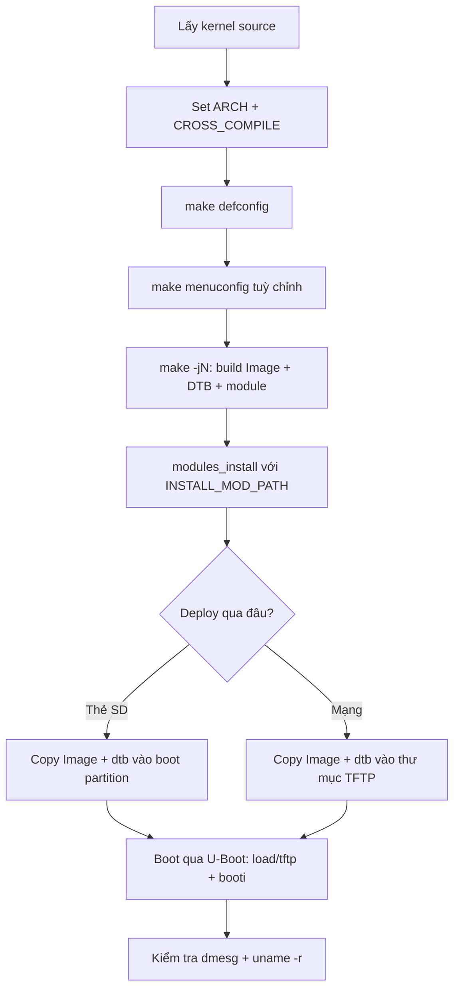

# Build kernel: cross-compile và deploy lên Raspberry Pi

!!! note "Mục tiêu"
    Sau bài này, cross-compile được kernel Linux từ source cho Raspberry Pi, tùy chỉnh cấu hình
    bằng `make menuconfig`, cài module đúng chỗ vào root filesystem, deploy kernel + Device Tree
    lên board qua U-Boot, và xác nhận đúng bản build mình vừa tạo đang chạy — không phải kernel
    có sẵn trên thẻ SD.

## Chuẩn bị

- Phần cứng: Raspberry Pi [ĐIỀN: model cụ thể — 3B/4B/Zero 2 W...], thẻ SD hoặc kết nối mạng đã
  sẵn TFTP server
- Đã cài/build trước đó: toolchain cross-compile — xem [Toolchain](toolchain.md); U-Boot đã vào
  được prompt và boot thử thành công ít nhất một lần (từ SD hoặc TFTP) — xem [U-Boot](u-boot.md)
- Khái niệm nên đọc trước: [Boot flow](boot-flow.md) — trang này giả định đã biết kernel image và
  Device Tree được bootloader load vào RAM thế nào trước khi kernel chạy

## Sơ đồ luồng thao tác



## Các bước

### 1. Lấy kernel source

```bash
git clone --depth=1 -b [ĐIỀN: branch/tag, ví dụ rpi-6.6.y] \
    https://github.com/raspberrypi/linux.git
cd linux
```

Fork `raspberrypi/linux` hỗ trợ đầy đủ peripheral riêng của board (VideoCore, camera...) mà
mainline chưa gom đủ. Nếu chỉ cần kernel chạy được, mainline `torvalds/linux` cũng boot được trên
RPi 4/400 trở lên.

### 2. Set ARCH và CROSS_COMPILE

```bash
export ARCH=arm64                       # hoặc arm nếu build kernel 32-bit
export CROSS_COMPILE=aarch64-linux-gnu-
```

Hai biến này cần đặt **trước** bước cấu hình, không chỉ trước bước build — một số option trong
`menuconfig` chỉ hiện ra tùy khả năng của compiler đang trỏ tới. Quên `export` thì `make` mặc
định build native cho máy host (x86), không báo lỗi rõ ràng nào cả.

### 3. Nạp cấu hình mặc định (defconfig)

```bash
make help | grep defconfig    # liệt kê defconfig có sẵn cho ARCH đang chọn
make [ĐIỀN: tên defconfig khớp board, ví dụ bcm2711_defconfig]
```

Trên ARM 32-bit thường có một defconfig riêng cho từng họ CPU. Trên ARM 64-bit mainline chỉ có
một defconfig lớn duy nhất, chỉnh tiếp bằng `menuconfig`; fork `raspberrypi/linux` vẫn giữ nhiều
defconfig riêng theo model để tiện hơn.

### 4. Tùy chỉnh bằng menuconfig

```bash
make menuconfig    # cần gói libncurses-dev trên máy host
```

Giao diện ncurses, điều hướng bằng phím mũi tên. Mỗi option có 3 trạng thái: `< >` tắt hẳn, `<M>`
build thành module (file `.ko` rời, load được lúc runtime), `<*>` build tĩnh vào thẳng kernel
image (có ngay từ lúc boot, trước khi có filesystem — bắt buộc với driver cần cho root
filesystem, ví dụ driver mmc/nvme). Thoát và chọn Save ghi ra file `.config` ở thư mục gốc kernel
source — file này không track bằng Git.

!!! tip "Bật NFS root nếu định dùng cách boot qua mạng"
    Muốn tiếp tục với NFS root như ở [U-Boot](u-boot.md#7-boot-qua-mạng-tftp--nfs), bật
    `CONFIG_NFS_FS`, `CONFIG_ROOT_NFS`, `CONFIG_IP_PNP` ngay ở bước này — thiếu một trong ba thì
    kernel không mount được root qua NFS dù bootargs đúng.

### 5. Build kernel, DTB và module

```bash
make -j$(nproc)
```

`-j$(nproc)` chạy song song theo số core máy host, rút thời gian build đáng kể. Rebuild lặp lại
nhiều lần (sau mỗi lần sửa `menuconfig`) thì thêm `ccache` vào trước tên cross-compiler để cache
kết quả biên dịch:

```bash
export CROSS_COMPILE="ccache aarch64-linux-gnu-"
```

Build xong có các file chính:

- `arch/arm64/boot/Image` — kernel image chưa nén, U-Boot load trực tiếp file này
- `arch/arm64/boot/dts/broadcom/*.dtb` — Device Tree Blob đã compile, mỗi file khớp một board
- `.ko` rải rác khắp source tree — các phần build dạng module
- `vmlinux` — bản ELF chưa nén ở thư mục gốc, dùng để debug (đưa vào GDB), không dùng để boot

### 6. Cài module vào root filesystem

```bash
make INSTALL_MOD_PATH=[ĐIỀN: đường dẫn root filesystem, vd /mnt/sdcard/rootfs hoặc thư mục NFS root] \
    modules_install
```

**Không** chạy `sudo make modules_install` trần — lệnh đó cài thẳng vào `/lib/modules/` của máy
host, không phải của board. `INSTALL_MOD_PATH` trỏ output sang root filesystem của target, và
không cần quyền root vì không đụng tới `/lib/modules` thật của host.

### 7. Copy kernel + DTB lên board

```bash
cp arch/arm64/boot/Image [ĐIỀN: /boot/firmware/ trên thẻ SD, hoặc /srv/tftp/ nếu boot qua mạng]
cp arch/arm64/boot/dts/broadcom/[ĐIỀN: tên-board].dtb [ĐIỀN: cùng đường dẫn ở trên]
```

### 8. Boot kernel mới qua U-Boot

Dùng lại đúng luồng lệnh đã quen ở [U-Boot](u-boot.md) — chỉ khác là kernel/DTB bây giờ là bản
tự build:

```
=> tftp ${kernel_addr_r} Image
=> tftp ${fdt_addr_r} [ĐIỀN: tên-board].dtb
=> setenv bootargs console=ttyS0,115200 root=/dev/mmcblk0p2 rootwait
=> booti ${kernel_addr_r} - ${fdt_addr_r}
```

(Thay `tftp` bằng `load mmc 0:1 ...` nếu deploy qua thẻ SD thay vì mạng.)

## Kiểm tra kết quả

```
[ĐIỀN: log dmesg thật ngay sau "Starting kernel..." — dòng banner kernel version]
```

Sau khi có shell trên board:

```
$ uname -r
[ĐIỀN: kernel version + local version string thật]
```

!!! tip "Đặt CONFIG_LOCALVERSION để khỏi nhầm bản build"
    `.config` có option string `CONFIG_LOCALVERSION` (đặt qua `menuconfig` → General setup),
    gắn thêm hậu tố vào tên kernel, ví dụ `-my-build`. Đặt trước khi build thì `uname -r` sau này
    phân biệt ngay bản tự build với kernel gốc có sẵn trên thẻ SD Raspberry Pi OS — đỡ mất công
    đoán xem board đang chạy kernel nào.

## Debug khi lỗi

!!! warning "Quên export ARCH/CROSS_COMPILE"
    Build không báo lỗi gì cả, nhưng ra binary cho kiến trúc host (x86) thay vì ARM. Board không
    boot được kernel đó, hoặc U-Boot báo `Bad Magic Number`/`Wrong Image Format` khi thử `booti`.
    Kiểm tra lại bằng `file arch/arm64/boot/Image` hoặc `echo $ARCH $CROSS_COMPILE` trước khi
    build lại.

!!! warning "DTB không khớp board hoặc không khớp kernel version"
    Copy nhầm DTB của board khác, hoặc dùng DTB cũ với kernel mới đã đổi cấu trúc device tree,
    dẫn đến thiếu peripheral hoặc kernel panic ngay khi probe driver. DTB và kernel Image nên
    build cùng một lần từ cùng source tree.

## Mở rộng

- `make savedefconfig` xuất ra một file defconfig tối giản (chỉ liệt kê phần khác mặc định) —
  lưu vào `arch/<arch>/configs/` và track bằng Git để chia sẻ cấu hình với người khác, giống cách
  làm với U-Boot.
- `make clean` xoá file build nhưng giữ `.config`; `make mrproper` xoá cả `.config` — dùng khi
  muốn cấu hình lại từ đầu hoàn toàn.

## Liên quan

- **Đọc trước:** [Toolchain](toolchain.md), [U-Boot](u-boot.md), [Boot flow](boot-flow.md)
- **Bước tiếp theo:** [Device Tree](device-tree.md), [Root filesystem](rootfs.md)

---
*Trang này dịch/phóng tác từ các phần "Kernel configuration", "Compiling and installing the
kernel" và "Booting the kernel" trong khóa Embedded Linux System Development của Bootlin, giấy
phép CC BY-SA 3.0. Bản gốc: https://bootlin.com/training/embedded-linux.*
