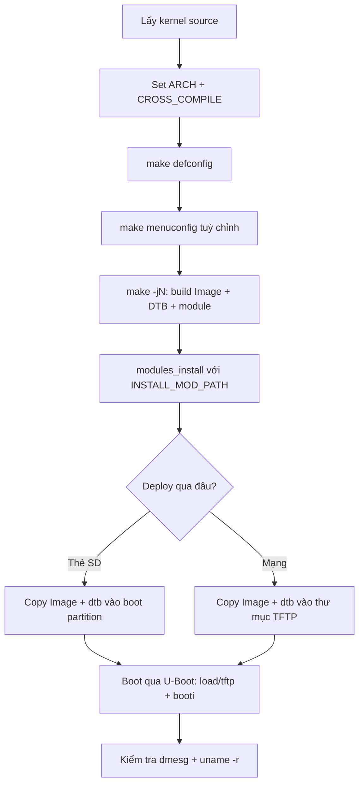

# Build kernel: cross-compile và deploy lên Raspberry Pi

!!! note "Mục tiêu"
    Sau bài này, cross-compile được kernel Linux từ source cho Raspberry Pi, tùy chỉnh cấu hình
    bằng `make menuconfig`, cài module đúng chỗ vào root filesystem, deploy kernel + Device Tree
    lên board qua U-Boot, và xác nhận đúng bản build mình vừa tạo đang chạy — không phải kernel
    có sẵn trên thẻ SD.

## Chuẩn bị

- Phần cứng: Raspberry Pi [ĐIỀN: model cụ thể — 3B/4B/Zero 2 W...], thẻ SD hoặc kết nối mạng đã
  sẵn TFTP server
- Đã cài/build trước đó: toolchain cross-compile — xem [Toolchain](toolchain.md); U-Boot đã vào
  được prompt và boot thử thành công ít nhất một lần (từ SD hoặc TFTP) — xem [U-Boot](u-boot.md)
- Khái niệm nên đọc trước: [Boot flow](boot-flow.md) — trang này giả định đã biết kernel image và
  Device Tree được bootloader load vào RAM thế nào trước khi kernel chạy

## Sơ đồ luồng thao tác



## Các bước

### 1. Lấy kernel source

```bash
git clone --depth=1 -b [ĐIỀN: branch/tag, ví dụ rpi-6.6.y] \
    https://github.com/raspberrypi/linux.git
cd linux
```

Fork `raspberrypi/linux` hỗ trợ đầy đủ peripheral riêng của board (VideoCore, camera...) mà
mainline chưa gom đủ. Nếu chỉ cần kernel chạy được, mainline `torvalds/linux` cũng boot được trên
RPi 4/400 trở lên.

### 2. Set ARCH và CROSS_COMPILE

```bash
export ARCH=arm64                       # hoặc arm nếu build kernel 32-bit
export CROSS_COMPILE=aarch64-linux-gnu-
```

Hai biến này cần đặt **trước** bước cấu hình, không chỉ trước bước build — một số option trong
`menuconfig` chỉ hiện ra tùy khả năng của compiler đang trỏ tới. Quên `export` thì `make` mặc
định build native cho máy host (x86), không báo lỗi rõ ràng nào cả.

Cũng có thể truyền thẳng trên dòng lệnh mỗi lần gọi `make` thay vì `export`, ví dụ
`make ARCH=arm64 CROSS_COMPILE=aarch64-linux-gnu- menuconfig` — khỏi lo quên set khi mở shell
mới, đổi lại phải gõ lại ở mọi lệnh `make` sau. Build system như Buildroot/Yocto tự động truyền
theo kiểu này thay vì export. Muốn build bằng Clang thay vì GCC thì thêm `LLVM=1`.

!!! note "Bài này đi theo nhánh 64-bit (arm64)"
    Từ đây, mọi lệnh và tên file trong bài giả sử `ARCH=arm64`. Đi nhánh 32-bit (`ARCH=arm`) thì
    tên file kernel và lệnh boot khác hẳn: ảnh kernel đã nén sẵn tên `zImage` (ở
    `arch/arm/boot/`, khác `Image` chưa nén của arm64), và U-Boot boot bằng `bootz` thay vì
    `booti`. Chọn nhánh 32-bit thì đổi lại toàn bộ những chỗ đó ở các bước sau.

### 3. Nạp cấu hình mặc định (defconfig)

```bash
make help | grep defconfig    # liệt kê defconfig có sẵn cho ARCH đang chọn
make [ĐIỀN: tên defconfig khớp board, ví dụ bcm2711_defconfig]
```

Trên ARM 32-bit thường có một defconfig riêng cho từng họ CPU. Trên ARM 64-bit mainline chỉ có
một defconfig lớn duy nhất, chỉnh tiếp bằng `menuconfig`; fork `raspberrypi/linux` vẫn giữ nhiều
defconfig riêng theo model để tiện hơn.

!!! warning "Nạp defconfig xoá `.config` đang có"
    `make foo_defconfig` ghi đè thẳng lên `.config` hiện tại, không hỏi lại. Đang chỉnh dở
    `menuconfig` mà tò mò thử defconfig khác thì mất hết thay đổi chưa lưu ra file riêng.

### 4. Tùy chỉnh bằng menuconfig

```bash
make menuconfig    # cần gói libncurses-dev trên máy host
```

Giao diện ncurses, điều hướng bằng phím mũi tên. Kconfig có nhiều loại option: `bool` (chỉ
bật/tắt), `tristate` — 3 trạng thái `< >` tắt hẳn, `<M>` build thành module (file `.ko` rời, nạp
được lúc runtime), `<*>` build tĩnh vào thẳng kernel image — và `int`/`hex`/`string` để nhập giá
trị số hoặc chuỗi (dùng ở tip `CONFIG_LOCALVERSION` cuối bài). Option `<*>` có ngay từ lúc boot,
trước khi có filesystem — bắt buộc với driver cần cho root filesystem (mmc, nvme...); `<M>` chỉ
nạp được sau khi có filesystem nên không dùng được ở giai đoạn boot sớm.

!!! tip "Bật một option mà không thấy nó trong menu?"
    Option Kconfig có thể khai báo `depends on` — chỉ hiện ra khi option nó phụ thuộc đã bật
    trước đó. Khác với `select`: option A `select` B thì bật A tự động bật kèm B, không tắt
    riêng B được — thường dùng khi driver cần bắt buộc một thư viện con. Tìm mãi không thấy
    option cần bật, kiểm tra lại option nó phụ thuộc đã bật chưa.

!!! tip "Bật NFS root nếu định dùng cách boot qua mạng"
    Muốn tiếp tục với NFS root như ở [U-Boot](u-boot.md#7-boot-qua-mang-tftp-nfs), bật
    `CONFIG_NFS_FS`, `CONFIG_ROOT_NFS`, `CONFIG_IP_PNP` ngay ở bước này — thiếu một trong ba thì
    kernel không mount được root qua NFS dù bootargs đúng.

Thoát và chọn Save ghi ra file `.config` ở thư mục gốc kernel source — text đơn giản dạng
`CONFIG_FOO=y`/`CONFIG_FOO=m`, tắt thì ghi thành comment `# CONFIG_FOO is not set`; file này
không track bằng Git. Mỗi lần lưu, công cụ giữ lại bản trước ở `.config.old` — lỡ đổi sai mà
không nhớ đã sửa gì thì `cp .config.old .config` là quay lại ngay bản trước đó.

Ngoài `menuconfig`, còn có `make xconfig` (giao diện Qt, cần gói `qtbase5-dev`) và `make nconfig`
(vẫn ncurses nhưng tìm kiếm nhanh hơn) — cả ba đọc/ghi chung một file `.config`, dùng cái nào tuỳ
thích.

### 5. Build kernel, DTB và module

```bash
make -j$(nproc)
```

Chạy bằng user thường, **không** dùng `sudo` — kernel source không cần quyền root để build, và
build bằng root dễ khiến file trong source tree bị đổi owner, gây lỗi khó hiểu khi build lại bằng
user thường sau đó.

`-j$(nproc)` chạy song song theo số core máy host, rút thời gian build đáng kể. Rebuild lặp lại
nhiều lần (sau mỗi lần sửa `menuconfig`) thì thêm `ccache` vào trước tên cross-compiler để cache
kết quả biên dịch:

```bash
export CROSS_COMPILE="ccache aarch64-linux-gnu-"
```

Build xong có các file chính:

- `arch/arm64/boot/Image` — kernel image chưa nén, U-Boot load trực tiếp file này (build 32-bit
  thì đây là `arch/arm/boot/zImage`, đã nén — xem lưu ý kiến trúc ở bước 2)
- `arch/arm64/boot/dts/broadcom/*.dtb` — Device Tree Blob đã compile, mỗi file khớp một board
- `.ko` rải rác khắp source tree — các phần build dạng module
- `vmlinux` — bản ELF chưa nén ở thư mục gốc, dùng để debug (đưa vào GDB), không dùng để boot

### 6. Cài module vào root filesystem

```bash
make INSTALL_MOD_PATH=[ĐIỀN: đường dẫn root filesystem, vd /mnt/sdcard/rootfs hoặc thư mục NFS root] \
    modules_install
```

**Không** chạy `sudo make modules_install` trần — lệnh đó cài thẳng vào `/lib/modules/` của máy
host, không phải của board. `INSTALL_MOD_PATH` trỏ output sang root filesystem của target, và
không cần quyền root vì không đụng tới `/lib/modules` thật của host.

Ngoài các file `.ko`, lệnh này còn sinh `modules.dep`, `modules.alias`, `modules.symbols` trong
cùng thư mục — đây là bảng tra dependency giữa các module. Nhờ chúng mà `modprobe` trên board tự
nạp đúng thứ tự các module phụ thuộc nhau, khỏi phải `insmod` tay từng cái theo đúng thứ tự.

### 7. Copy kernel + DTB lên board

Board embedded thường có nhiều phần cứng không tự dò được (I2C, SPI, NAND...). Khác x86 dùng
ACPI, kernel Linux trên embedded nhận mô tả phần cứng này qua Device Tree Blob nạp cùng lúc với
kernel image — xem sâu hơn ở [Device Tree](device-tree.md).

```bash
cp arch/arm64/boot/Image [ĐIỀN: /boot/firmware/ trên thẻ SD, hoặc /srv/tftp/ nếu boot qua mạng]
cp arch/arm64/boot/dts/broadcom/[ĐIỀN: tên-board].dtb [ĐIỀN: cùng đường dẫn ở trên]
```

### 8. Boot kernel mới qua U-Boot

Dùng lại đúng luồng lệnh đã quen ở [U-Boot](u-boot.md) — chỉ khác là kernel/DTB bây giờ là bản
tự build:

```
=> tftp ${kernel_addr_r} Image
=> tftp ${fdt_addr_r} [ĐIỀN: tên-board].dtb
=> setenv bootargs console=ttyS0,115200 root=/dev/mmcblk0p2 rootwait
=> booti ${kernel_addr_r} - ${fdt_addr_r}
```

Dấu `-` ở giữa hai địa chỉ nghĩa là không truyền initramfs (chỗ đó dành cho địa chỉ initramfs nếu
có).

(Thay `tftp` bằng `load mmc 0:1 ...` nếu deploy qua thẻ SD; thay `booti` bằng `bootz` nếu build
kernel 32-bit ở bước 2.)

## Kiểm tra kết quả

```
[ĐIỀN: log dmesg thật ngay sau "Starting kernel..." — dòng banner kernel version]
```

`dmesg` đọc từ một circular buffer kernel giữ trong RAM, cỡ đặt qua `CONFIG_LOG_BUF_SHIFT` lúc
build — buffer đầy thì log cũ nhất bị ghi đè, không phải "biến mất". Log hiện ra trên console
(cổng chỉ định bởi `console=` trong bootargs) còn lọc riêng theo `loglevel=` — console im ắng mà
nghi kernel vẫn chạy thì thử thêm `loglevel=8` vào bootargs.

Sau khi có shell trên board:

```
$ uname -r
[ĐIỀN: kernel version + local version string thật]
```

!!! tip "Đặt CONFIG_LOCALVERSION để khỏi nhầm bản build"
    `.config` có option string `CONFIG_LOCALVERSION` (đặt qua `menuconfig` → General setup),
    gắn thêm hậu tố vào tên kernel, ví dụ `-my-build`. Đặt trước khi build thì `uname -r` sau này
    phân biệt ngay bản tự build với kernel gốc có sẵn trên thẻ SD Raspberry Pi OS — đỡ mất công
    đoán xem board đang chạy kernel nào.

## Debug khi lỗi

!!! warning "Quên export ARCH/CROSS_COMPILE"
    Build không báo lỗi gì cả, nhưng ra binary cho kiến trúc host (x86) thay vì ARM. Board không
    boot được kernel đó, hoặc U-Boot báo `Bad Magic Number`/`Wrong Image Format` khi thử `booti`.
    Kiểm tra lại bằng `file arch/arm64/boot/Image` hoặc `echo $ARCH $CROSS_COMPILE` trước khi
    build lại.

!!! warning "DTB không khớp board hoặc không khớp kernel version"
    Copy nhầm DTB của board khác, hoặc dùng DTB cũ với kernel mới đã đổi cấu trúc device tree,
    dẫn đến thiếu peripheral hoặc kernel panic ngay khi probe driver. DTB và kernel Image nên
    build cùng một lần từ cùng source tree.

!!! warning "Set bootargs xong không thấy tác dụng gì"
    Kernel không mặc định dùng thẳng `bootargs` từ U-Boot — còn tuỳ option lúc build:
    `CONFIG_CMDLINE_FROM_BOOTLOADER` (dùng đúng chuỗi từ bootloader), `CONFIG_CMDLINE_FORCE`
    (bỏ qua bootloader, chỉ dùng chuỗi `CONFIG_CMDLINE` biên dịch sẵn trong kernel), hoặc
    `CONFIG_CMDLINE_EXTEND` (nối cả hai chuỗi lại). `setenv bootargs` đúng mà board vẫn boot như
    trước khi đổi, kiểm tra lại ba option này trong `menuconfig`.

## Mở rộng

- `make savedefconfig` xuất ra một file defconfig tối giản (chỉ liệt kê phần khác mặc định) —
  lưu vào `arch/<arch>/configs/` và track bằng Git để chia sẻ cấu hình với người khác, giống cách
  làm với U-Boot.
- `make clean` xoá file build nhưng giữ `.config`; `make mrproper` xoá cả `.config`; `make
  distclean` xoá thêm cả file backup của editor và file patch — dùng khi cây source lẫn quá
  nhiều rác. Đang làm việc trong git tree thì `git clean -fdx` dọn sạch mọi file không track,
  gọn hơn gõ từng target cleanup.
- Cập nhật kernel source lên version mới rồi build lại (`git pull` trên nhánh đang theo), chạy
  `make oldconfig` thay vì nạp lại defconfig — nó hỏi giá trị cho từng option mới xuất hiện thay
  vì âm thầm gán mặc định như `menuconfig`/`xconfig` vẫn làm.

## Liên quan

- **Đọc trước:** [Toolchain](toolchain.md), [U-Boot](u-boot.md), [Boot flow](boot-flow.md)
- **Bước tiếp theo:** [Device Tree](device-tree.md), [Root filesystem](rootfs.md)

---
*Trang này dịch/phóng tác từ các phần "Kernel configuration", "Compiling and installing the
kernel" và "Booting the kernel" trong khóa Embedded Linux System Development của Bootlin, giấy
phép CC BY-SA 3.0. Bản gốc: https://bootlin.com/training/embedded-linux.*
