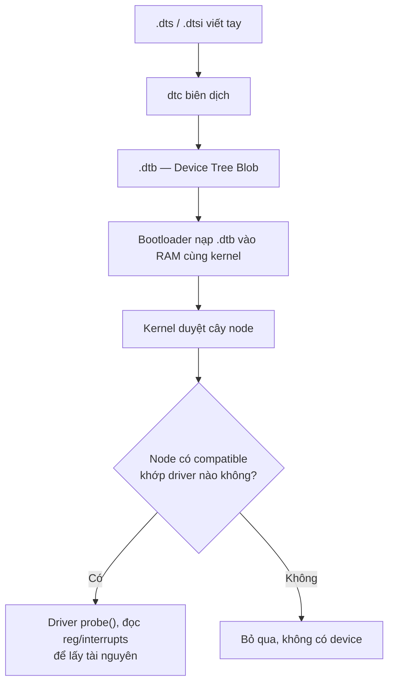
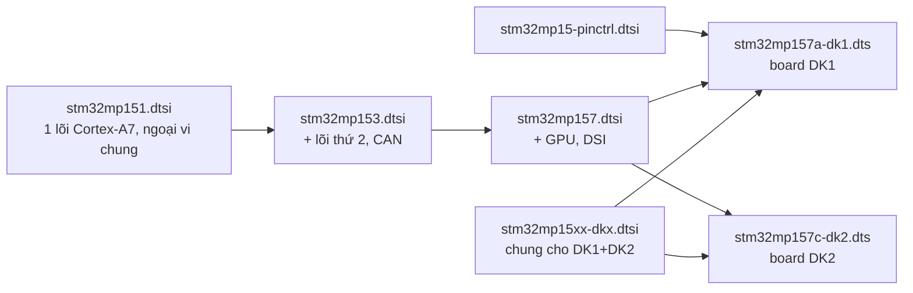

# Device Tree: node, property và overlay

!!! note "Mục tiêu"
    Sau bài này, cậu đọc hiểu được một node bất kỳ trong file `.dts` thật của kernel, biết node
    nào bind vào driver nào qua `compatible`, và tự viết + biên dịch được một Device Tree overlay
    để bật một thiết bị I2C trên Raspberry Pi mà không cần build lại kernel.

Trước khi có Device Tree, kernel Linux mô tả phần cứng không tự phát hiện được theo đúng ba cách:
viết thẳng cấu trúc dữ liệu C hardcode trong code kernel/bootloader (cách cũ, không maintain nổi
khi số board ARM tăng lên); dùng bảng ACPI do firmware cung cấp (phổ biến trên x86, một phần
ARM64); hoặc dùng Device Tree. DT có gốc từ chuẩn OpenFirmware của Sun (dùng trên SPARC/PowerPC) —
đây cũng là lý do nhiều API kernel/U-Boot liên quan tới DT mang tiền tố `of_` (Open Firmware), ví
dụ `of_device_id` sẽ gặp ở bước 4.

## Chuẩn bị

- Phần cứng: Raspberry Pi (đã setup ở [Setup môi trường](../00-bat-dau/moi-truong.md))
- Đã cài: gói `device-tree-compiler` (lệnh `dtc`); kernel source đã clone — xem
  [Build kernel](build-kernel.md)
- Khái niệm nên đọc trước: [Boot flow](boot-flow.md) — biết DTB được bootloader nạp vào RAM cùng
  kernel ở chặng nào; [U-Boot](u-boot.md)

## Sơ đồ luồng thao tác



## Các bước

### 1. Biên dịch thử một file .dts tối giản

Cài `dtc` rồi thử vòng dts → dtb → dts để thấy công cụ này chấp nhận cú pháp gì:

```bash
sudo apt install device-tree-compiler
```

```
$ cat foo.dts
/dts-v1/;

/ {
	welcome = <0xBADCAFE>;
	bootlin {
		webinar = "great";
		demo = <1>, <2>, <3>;
	};
};

$ dtc -I dts -O dtb -o foo.dtb foo.dts
$ dtc -I dtb -O dts foo.dtb          # xem lại dạng text sau khi nén thành blob
```

`dtc` chỉ kiểm tra **cú pháp** — property sai số cell hay thiếu tài nguyên vẫn biên dịch qua bình
thường, lỗi chỉ lộ ra khi kernel thật sự chạy và cố đọc property đó.

`.dtb` sau khi được bootloader nạp vào RAM còn có một tên gọi khác: **FDT** (*Flattened Device
Tree*) — gặp tên này trong log U-Boot (`Loading Device Tree to ...`), lệnh `fdt`, hay các API
`fdt_*` thì hiểu đó vẫn là cùng một file `.dtb`. Ngoài cách nạp rời phổ biến nhất, DTB cũng có thể
**link thẳng vào bootloader** như một phần binary (U-Boot/Barebox làm vậy với DTB mặc định của
board) thay vì tách file riêng; dù ở bootloader hay kernel, việc đọc/ghi các trường trong DTB đều
dùng chung thư viện `libfdt` — một phần lý do DT giữ được tính OS-agnostic sẽ nói kỹ ở bước 8.

### 2. Đọc cấu trúc một node

Một node bất kỳ trong `.dts` trông như sau (rút gọn từ device tree STM32MP1):

```
i2c1: i2c@40012000 {
	compatible = "st,stm32mp15-i2c";
	reg = <0x40012000 0x400>;
	interrupts = <GIC_SPI 31 IRQ_TYPE_LEVEL_HIGH>;
	status = "okay";

	cs42l51: cs42l51@4a {
		compatible = "cirrus,cs42l51";
		reg = <0x4a>;
	};
};
```

- **Node name** (`i2c`) + **unit address** (`@40012000`) — địa chỉ này phải trùng giá trị đầu
  tiên trong `reg` của chính node.
- **`i2c1:`** đứng trước tên node là **label**, dùng để node khác tham chiếu tới — không xuất
  hiện trong `.dtb` cuối cùng, chỉ tồn tại lúc biên dịch.
- **property** là các cặp `tên = giá trị;` bên trong node. Giá trị có thể là chuỗi, số 32-bit
  trong `<>` (mỗi số gọi là một **cell**), mảng byte trong `[]`, hoặc **phandle**.
- **phandle** là một kiểu tham chiếu tới node khác, viết `<&label>`. `dtc` tự sinh property
  `phandle` (một số nguyên duy nhất) cho node được trỏ tới, rồi thay `&label` bằng số đó khi biên
  dịch ra `.dtb` — trong `.dts` cậu chỉ thấy dạng `&label` dễ đọc, không thấy con số thật.

### 3. Ba node luôn có mặt: `cpus`, `memory`, `chosen`

Mọi Device Tree hoàn chỉnh — không riêng ví dụ tối giản ở bước 1 — đều có ba node cấp cao gần như
bắt buộc, mô tả những thứ không gắn với một driver/peripheral cụ thể nào:

```
/ {
	cpus {
		#address-cells = <1>;
		#size-cells = <0>;
		cpu0: cpu@0 {
			compatible = "arm,cortex-a7";
			device_type = "cpu";
			reg = <0>;
		};
	};

	memory@0 {
		device_type = "memory";
		reg = <0x0 0x20000000>;
	};

	chosen {
		bootargs = "";
		stdout-path = "serial0:115200n8";
	};
};
```

- **`cpus`** liệt kê từng lõi CPU dưới dạng node `cpu@N` — `reg` ở đây là **số hiệu core**, không
  phải địa chỉ thanh ghi, đúng quy tắc "ý nghĩa `reg` phụ thuộc node cha" sẽ nói rõ hơn ở bước 5.
- **`memory@0`** khai báo vùng RAM thật có trên board (`reg = <base size>`) — bootloader/kernel
  dựa vào đây biết RAM lớn tới đâu, không tự dò.
- **`chosen`** không mô tả phần cứng — đây là chỗ bootloader **truyền dữ liệu runtime cho
  kernel**. `bootargs` chính là kernel command line (đã gặp `root=`, `console=` ở trang
  [U-Boot](u-boot.md) qua `setenv bootargs`) — hoá ra DT cũng mang được giá trị này, và bootloader
  có thể ghi đè nó lúc boot chứ không chỉ đọc từ biến môi trường; `stdout-path` chỉ định UART nào
  là console.

Muốn xem bản đầy đủ không rút gọn, mở kernel source đã clone ở `arch/<ARCH>/boot/dts/<vendor>/`
— đây là nơi lưu chính thức các file `.dts`/`.dtsi` thật (không có kho Device Tree trung lập nào
khác ngoài kernel).

### 4. `compatible` — cầu nối tới driver

`compatible` là danh sách chuỗi, xếp từ cụ thể đến chung, theo mẫu `vendor,model`. Kernel dùng
đúng chuỗi này để tìm driver phù hợp — mỗi driver có sẵn bảng `of_device_id[]` liệt kê các
`compatible` nó hỗ trợ:

```c
static const struct of_device_id stm32_match[] = {
	{ .compatible = "st,stm32h7-uart", .data = &stm32h7_info },
	{},
};
MODULE_DEVICE_TABLE(of, stm32_match);
```

Node nào có `compatible` khớp bảng này thì driver được **bind**, hàm `probe()` chạy. Giá trị
`compatible = "simple-bus"` là trường hợp đặc biệt: các node con của nó cũng được kernel duyệt và
bind như platform device riêng lẻ, không cần driver cho chính node `simple-bus`.

Cơ chế match qua `compatible` không chỉ dành cho `platform_driver` — driver I2C cũng dùng đúng
kiểu bảng `of_device_id[]`, chỉ khác chỗ gắn vào `i2c_driver` thay vì `platform_driver`:

```c
// sound/soc/codecs/cs42l51.c
const struct of_device_id cs42l51_of_match[] = {
	{ .compatible = "cirrus,cs42l51", },
	{ }
};
MODULE_DEVICE_TABLE(of, cs42l51_of_match);

// sound/soc/codecs/cs42l51-i2c.c
static struct i2c_driver cs42l51_i2c_driver = {
	.driver = {
		.name = "cs42l51",
		.of_match_table = cs42l51_of_match,
	},
	.probe = cs42l51_i2c_probe,
	.id_table = cs42l51_i2c_id,   /* fallback khi không có DT */
};
```

**Biết property nào cần khai cho một `compatible` mới thì đừng đoán** — mỗi loại thiết bị có một
**Device Tree Binding**, tài liệu (ngày nay viết dạng YAML) nằm ở
`Documentation/devicetree/bindings/` trong kernel source, liệt kê property nào bắt buộc/tuỳ chọn.
Bản rút gọn cho I2C controller STM32:

```yaml
properties:
  compatible:
    enum: [st,stm32f4-i2c, st,stm32f7-i2c, st,stm32mp15-i2c]
  reg:
    maxItems: 1
  interrupts:
    items:
      - description: interrupt ID for I2C event
      - description: interrupt ID for I2C error
required: [compatible, reg, interrupts, resets, clocks]
```

`make dt_binding_check` kiểm tra chính file YAML này có hợp lệ; `make dtbs_check` đối chiếu `.dts`
thật đang bật với binding — hai lệnh này bù đắp cho việc `dtc` chỉ kiểm tra cú pháp, không biết
node có đủ property đúng chuẩn của thiết bị hay không.

### 5. `reg` — vùng tài nguyên của node

Ý nghĩa của `reg` phụ thuộc bus mà node đang nằm trong:

| Ngữ cảnh | Ý nghĩa `reg` |
|---|---|
| Node memory-mapped (dưới `soc`) | Địa chỉ vật lý + kích thước vùng thanh ghi: `reg = <base size>` |
| Node con của I2C controller | Địa chỉ 7-bit của thiết bị trên bus I2C |
| Node con của SPI controller | Số chip-select |

Số cell trong `reg` (có tách base/size hay chỉ một giá trị) do node cha khai báo qua
`#address-cells`/`#size-cells` — vì vậy node bus luôn phải khai hai property này trước khi có node
con dùng `reg`.

### 6. `interrupts` — dây ngắt trỏ tới interrupt controller nào

```
intc: interrupt-controller@a0021000 {
	compatible = "arm,cortex-a7-gic";
	#interrupt-cells = <3>;
	interrupt-controller;
	reg = <0xa0021000 0x1000>, <0xa0022000 0x2000>;
};

soc {
	interrupt-parent = <&intc>;   /* mọi node con dùng chung interrupt controller này */

	usart1: serial@5c000000 {
		interrupts = <GIC_SPI 37 IRQ_TYPE_LEVEL_HIGH>;
	};
};
```

`interrupt-parent` là một **phandle** trỏ tới node interrupt controller sẽ xử lý ngắt của node
này — khai ở node cha (`soc`) thì mọi node con thừa hưởng, khỏi lặp lại. Số cell trong `interrupts`
do chính `#interrupt-cells` của interrupt controller quyết định; GIC dùng 3 cell: loại ngắt
(SPI/PPI), số hiệu, cờ trigger. Node nào cần một interrupt controller khác node cha thì dùng
`interrupts-extended = <&controller-khác ...>` thay vì tách riêng `interrupt-parent`.

Mẫu "controller khai `#foo-cells`, node tiêu thụ tham chiếu `foo = <&controller ...>`" ở trên
**không phải riêng cho ngắt** — clock, reset line, kênh DMA và cả pin GPIO đều mô tả theo đúng
công thức này:

```
spi3: spi@4000c000 {
	interrupts = <GIC_SPI 51 IRQ_TYPE_LEVEL_HIGH>;
	clocks = <&rcc SPI3_K>;
	resets = <&rcc SPI3_R>;
	dmas = <&dmamux1 61 0x400 0x05>, <&dmamux1 62 0x400 0x05>;
};
```

Nhận ra pattern này thì đọc `clocks =`/`resets =`/`dmas =`/`gpios =` trong bất kỳ `.dts` thật nào
cũng không còn lạ — mỗi property khác nhau về ý nghĩa cell, nhưng cơ chế tham chiếu là một.

### 7. `status` — bật/tắt node

Property đã xuất hiện ở gần như mọi ví dụ từ đầu trang nhưng chưa giải thích: `status` cho biết
node có **thật sự được dùng** hay không.

| Giá trị | Ý nghĩa |
|---|---|
| `"okay"` (hoặc `"ok"`) | Thiết bị có thật, kernel sẽ instantiate |
| Bất kỳ giá trị nào khác (quy ước dùng `"disabled"`) | Bỏ qua — không tạo device dù node có đủ `compatible`/`reg` |

Quy ước phổ biến: file `.dtsi` mô tả SoC đặt `status = "disabled";` cho mọi peripheral **hướng ra
ngoài chip** (I2C, SPI, UART...) vì bản thân SoC không tự biết board nào thật sự nối gì vào chân
đó; file `.dts` của từng board mới bật `"okay"` đúng những gì board thật có — chính là điều bước 8
(`&label { status = "okay"; };`) và overlay ở bước 10 đang làm.

### 8. `.dtsi` vs `.dts` — kế thừa và ghi đè

`.dtsi` là file được `#include`, chứa phần chung (định nghĩa SoC, dùng chung cho nhiều board);
`.dts` là file cuối cùng, board cụ thể — chỉ `.dts` được đưa thẳng cho `dtc`. Include hoạt động
bằng cách **overlay cây node** của file include lên cây gốc theo tên node: property trùng tên bị
ghi đè, property mới được cộng thêm.

!!! tip "Vì sao chia .dtsi/.dts theo đúng ranh giới SoC/board"
    Cách chia này đến từ 3 nguyên tắc thiết kế Device Tree: (1) DT mô tả **phần cứng đang có**,
    không mô tả **cách mình chọn dùng nó** — configuration thuộc về driver hoặc userspace, không
    nhét vào DT; (2) DT **OS-agnostic** — cùng một board, DT giống hệt nhau dù chạy U-Boot,
    FreeBSD hay Linux, không có lý do phải đổi DT khi đổi OS; (3) DT mô tả **tích hợp giữa các
    khối** (IRQ nào nối khối nào, clock nào cấp cho ai) chứ không mô tả **cách một IP block hoạt
    động bên trong** — phần đó thuộc code driver. `.dtsi` (tầng SoC, cố định theo chip) và `.dts`
    (tầng board, do người tích hợp board quyết định nối gì) là ranh giới tự nhiên theo đúng 3
    nguyên tắc trên.

```
/* soc.dtsi — khai báo phần cứng có sẵn trên SoC, mặc định tắt */
usart1: serial@5c000000 {
	compatible = "st,stm32h7-uart";
	status = "disabled";
};
```

```
/* board.dts — bật lên, tham chiếu thẳng qua label */
#include "soc.dtsi"

&usart1 {
	status = "okay";
};
```

Viết `&usart1 { ... };` (dùng label thay vì lặp lại toàn bộ đường dẫn node) là cách làm phổ biến
nhất hiện nay — ngắn gọn và không phụ thuộc node cha nằm sâu bao nhiêu cấp.

Ví dụ trên đã rút gọn tối đa — thực tế DT của một họ SoC thường kế thừa qua **nhiều tầng**, không
chỉ một cặp `.dtsi`/`.dts`. Case thật của STM32MP1:



Mỗi tầng `#include` thêm một lớp — càng lên board cụ thể, node càng được ghi đè/bật đúng những gì
mạch thật có, đúng chuỗi ".dtsi chung → .dtsi riêng → .dts board" vừa giải thích ở trên.

### 9. Pin-muxing / pinctrl

SoC hiện đại có nhiều chức năng hơn số chân vật lý expose ra ngoài — mỗi chân thường dùng được
cho *một trong nhiều* chức năng (GPIO thường, hoặc UART, hoặc SPI...), do một khối **pinmux
controller** trong SoC chọn. Device Tree mô tả cả cấu hình khả dụng lẫn cấu hình nào đang được
dùng, qua node `pin-controller` khai báo pin/chức năng:

```
&pinctrl {
	i2c1_pins_a: i2c1-0 {
		pins {
			pinmux = <STM32_PINMUX('D', 12, AF5)>, /* I2C1_SCL */
			         <STM32_PINMUX('F', 15, AF5)>; /* I2C1_SDA */
			bias-disable;
		};
	};
};
```

Node tiêu thụ (ví dụ `i2c1` ở các bước trước) tham chiếu tới cấu hình này qua ba property đi cùng
nhau:

```
&i2c1 {
	pinctrl-names = "default", "sleep";
	pinctrl-0 = <&i2c1_pins_a>;
	pinctrl-1 = <&i2c1_sleep_pins_a>;
};
```

`pinctrl-names` đặt tên cho từng **state** (`default`, `sleep`...), `pinctrl-N` là phandle tới
cấu hình pin tương ứng — các state loại trừ nhau, driver tự chuyển qua lại lúc runtime, riêng
state `default` được kernel tự áp dụng ngay khi driver `probe()`. Gặp `pinctrl-0 = <&label>;`
trong `.dts` thật thì đó chính là phandle trỏ tới một node như `i2c1_pins_a` ở trên — không phải
cú pháp mới, chỉ là một subsystem khác dùng lại đúng cơ chế phandle đã học.

### 10. Viết một Device Tree overlay

Overlay dùng đúng cú pháp `&label { ... };` ở bước 8, nhưng **biên dịch riêng thành file `.dtbo`**
rồi nạp thêm vào `.dtb` gốc lúc chạy — không cần build lại toàn bộ kernel/DTB mỗi lần thử một
thiết bị mới. Raspberry Pi dùng cơ chế này rất nhiều, qua thư mục `/boot/firmware/overlays/`.

```
/dts-v1/;
/plugin/;

/ {
	compatible = "[ĐIỀN: compatible SoC — vd \"brcm,bcm2711\" cho Pi 4]";

	fragment@0 {
		target = <&i2c1>;
		__overlay__ {
			status = "okay";

			bme280: bme280@76 {
				compatible = "bosch,bme280";
				reg = <0x76>;
			};
		};
	};
};
```

`/plugin/;` báo cho `dtc` biết đây là overlay chứ không phải một `.dtb` đầy đủ. `target = <&i2c1>`
là phandle trỏ tới node sẽ được chèn thêm nội dung vào — muốn `target` tham chiếu bằng label thì
`.dtb` gốc phải được biên dịch kèm `-@` (giữ lại bảng `__symbols__`); firmware Raspberry Pi chính
thức đã bật sẵn cờ này.

```bash
dtc -@ -I dts -O dtb -o bme280.dtbo bme280-overlay.dts
sudo cp bme280.dtbo /boot/firmware/overlays/
```

Thêm vào `config.txt`:

```
dtoverlay=bme280
```

!!! note "Cách khác: thêm .dts tĩnh vào build thay vì overlay"
    Không phải board nào cũng có firmware hỗ trợ nạp overlay lúc chạy như Raspberry Pi. Cách làm
    truyền thống: tạo hẳn một file `.dts` mới `#include` board gốc, thêm dòng vào
    `arch/<ARCH>/boot/dts/<vendor>/Makefile`:

    ```makefile
    dtb-$(CONFIG_ARCH_STM32) += stm32mp157a-dk1.dtb \
                                 stm32mp157a-dk1-custom.dtb
    ```

    rồi `make dtbs` để có `.dtb` riêng, deploy thay hẳn file gốc. Không cần build lại kernel, chỉ
    cần build lại DTB — nhưng phải reflash/reload cả `.dtb` thay vì chỉ thêm overlay.

## Kiểm tra kết quả

Biên dịch không lỗi/warning là điều kiện cần đầu tiên:

```
$ dtc -@ -I dts -O dtb -o bme280.dtbo bme280-overlay.dts
```

Reboot board, xác nhận overlay đã nạp và thiết bị đã xuất hiện:

```
$ sudo dtoverlay -l
0: bme280
$ ls /sys/bus/iio/devices/
iio:device0
```

## Debug khi lỗi

!!! warning "`dtc` báo lỗi không tìm thấy label khi biên dịch overlay"
    `target = <&i2c1>` chỉ hoạt động nếu `.dtb` gốc được biên dịch kèm bảng `__symbols__`
    (`dtc -@`). Firmware Raspberry Pi chính thức đã bật sẵn cờ này; nếu tự build `.dtb` custom cho
    board khác, nhớ thêm `-@` lúc biên dịch DTB gốc, không chỉ overlay.

!!! warning "Overlay nạp được nhưng không thấy device dưới /sys"
    `dtoverlay -l` báo overlay đã load nhưng driver không probe — thường do `compatible` chưa
    khớp driver nào đang có trong kernel, hoặc địa chỉ I2C (`reg`) sai so với datasheet cảm biến
    thật. `dmesg | grep -i i2c` thường lộ ra lỗi giao tiếp cụ thể ngay lúc probe.

## Mở rộng

- Xem webinar *DeviceTree 101* của Bootlin (link cuối trang) nếu muốn xem đầy đủ cách Bootlin
  trình bày toàn bộ chương này, kể cả phần binding YAML nâng cao.
- Yocto/Buildroot build sẵn `.dtbo`/`.dtb` cho board custom qua recipe riêng — sẽ nhắc lại ở mục
  Yocto & BSP.

## Liên quan

- **Đọc trước:** [Boot flow](boot-flow.md), [U-Boot](u-boot.md)
- **Bước tiếp theo:** [Rootfs](rootfs.md), [Platform driver](../02-kernel-driver/platform-driver.md)

---
*Trang này dịch/phóng tác từ phần "Device Tree" (node/property/compatible/reg/interrupts/phandle,
`chosen`/`status`, binding, pin-muxing, kế thừa `.dtsi`/`.dts`) trong khóa Embedded Linux System
Development của Bootlin, giấy phép CC BY-SA 3.0. Bản gốc:
https://bootlin.com/training/embedded-linux. Xem thêm webinar "DeviceTree 101"
(Thomas Petazzoni, 2021): https://bootlin.com/blog/device-tree-101-webinar-slides-and-videos/.*
