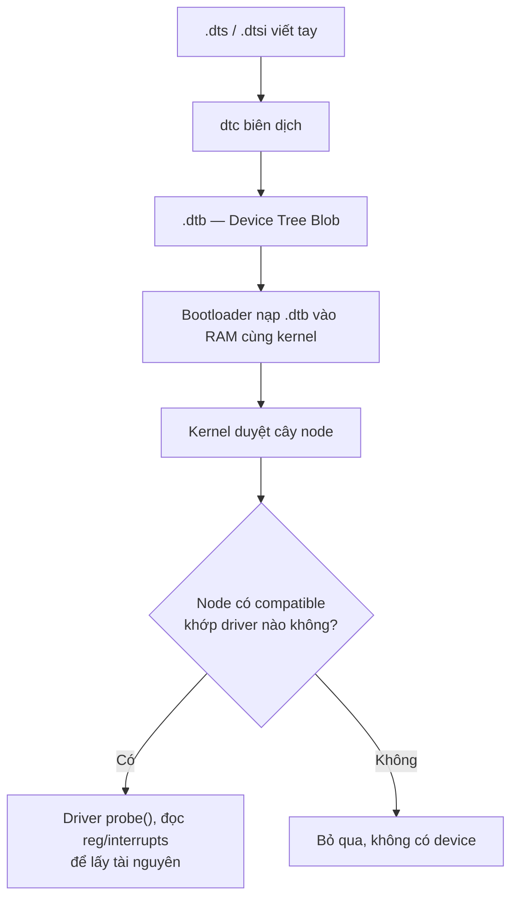

# Device Tree: node, property và overlay

!!! note "Mục tiêu"
    Sau bài này, cậu đọc hiểu được một node bất kỳ trong file `.dts` thật của kernel, biết node
    nào bind vào driver nào qua `compatible`, và tự viết + biên dịch được một Device Tree overlay
    để bật một thiết bị I2C trên Raspberry Pi mà không cần build lại kernel.

## Chuẩn bị

- Phần cứng: Raspberry Pi (đã setup ở [Setup môi trường](../00-bat-dau/moi-truong.md))
- Đã cài: gói `device-tree-compiler` (lệnh `dtc`); kernel source đã clone — xem
  [Build kernel](build-kernel.md)
- Khái niệm nên đọc trước: [Boot flow](boot-flow.md) — biết DTB được bootloader nạp vào RAM cùng
  kernel ở chặng nào; [U-Boot](u-boot.md)

## Sơ đồ luồng thao tác



## Các bước

### 1. Biên dịch thử một file .dts tối giản

Cài `dtc` rồi thử vòng dts → dtb → dts để thấy công cụ này chấp nhận cú pháp gì:

```bash
sudo apt install device-tree-compiler
```

```
$ cat foo.dts
/dts-v1/;

/ {
	welcome = <0xBADCAFE>;
	bootlin {
		webinar = "great";
		demo = <1>, <2>, <3>;
	};
};

$ dtc -I dts -O dtb -o foo.dtb foo.dts
$ dtc -I dtb -O dts foo.dtb          # xem lại dạng text sau khi nén thành blob
```

`dtc` chỉ kiểm tra **cú pháp** — property sai số cell hay thiếu tài nguyên vẫn biên dịch qua bình
thường, lỗi chỉ lộ ra khi kernel thật sự chạy và cố đọc property đó.

### 2. Đọc cấu trúc một node

Một node bất kỳ trong `.dts` trông như sau (rút gọn từ device tree STM32MP1):

```
i2c1: i2c@40012000 {
	compatible = "st,stm32mp15-i2c";
	reg = <0x40012000 0x400>;
	interrupts = <GIC_SPI 31 IRQ_TYPE_LEVEL_HIGH>;
	status = "okay";

	cs42l51: cs42l51@4a {
		compatible = "cirrus,cs42l51";
		reg = <0x4a>;
	};
};
```

- **Node name** (`i2c`) + **unit address** (`@40012000`) — địa chỉ này phải trùng giá trị đầu
  tiên trong `reg` của chính node.
- **`i2c1:`** đứng trước tên node là **label**, dùng để node khác tham chiếu tới — không xuất
  hiện trong `.dtb` cuối cùng, chỉ tồn tại lúc biên dịch.
- **property** là các cặp `tên = giá trị;` bên trong node. Giá trị có thể là chuỗi, số 32-bit
  trong `<>` (mỗi số gọi là một **cell**), mảng byte trong `[]`, hoặc **phandle**.
- **phandle** là một kiểu tham chiếu tới node khác, viết `<&label>`. `dtc` tự sinh property
  `phandle` (một số nguyên duy nhất) cho node được trỏ tới, rồi thay `&label` bằng số đó khi biên
  dịch ra `.dtb` — trong `.dts` cậu chỉ thấy dạng `&label` dễ đọc, không thấy con số thật.

### 3. `compatible` — cầu nối tới driver

`compatible` là danh sách chuỗi, xếp từ cụ thể đến chung, theo mẫu `vendor,model`. Kernel dùng
đúng chuỗi này để tìm driver phù hợp — mỗi driver có sẵn bảng `of_device_id[]` liệt kê các
`compatible` nó hỗ trợ:

```c
static const struct of_device_id stm32_match[] = {
	{ .compatible = "st,stm32h7-uart", .data = &stm32h7_info },
	{},
};
MODULE_DEVICE_TABLE(of, stm32_match);
```

Node nào có `compatible` khớp bảng này thì driver được **bind**, hàm `probe()` chạy. Giá trị
`compatible = "simple-bus"` là trường hợp đặc biệt: các node con của nó cũng được kernel duyệt và
bind như platform device riêng lẻ, không cần driver cho chính node `simple-bus`.

### 4. `reg` — vùng tài nguyên của node

Ý nghĩa của `reg` phụ thuộc bus mà node đang nằm trong:

| Ngữ cảnh | Ý nghĩa `reg` |
|---|---|
| Node memory-mapped (dưới `soc`) | Địa chỉ vật lý + kích thước vùng thanh ghi: `reg = <base size>` |
| Node con của I2C controller | Địa chỉ 7-bit của thiết bị trên bus I2C |
| Node con của SPI controller | Số chip-select |

Số cell trong `reg` (có tách base/size hay chỉ một giá trị) do node cha khai báo qua
`#address-cells`/`#size-cells` — vì vậy node bus luôn phải khai hai property này trước khi có node
con dùng `reg`.

### 5. `interrupts` — dây ngắt trỏ tới interrupt controller nào

```
intc: interrupt-controller@a0021000 {
	compatible = "arm,cortex-a7-gic";
	#interrupt-cells = <3>;
	interrupt-controller;
	reg = <0xa0021000 0x1000>, <0xa0022000 0x2000>;
};

soc {
	interrupt-parent = <&intc>;   /* mọi node con dùng chung interrupt controller này */

	usart1: serial@5c000000 {
		interrupts = <GIC_SPI 37 IRQ_TYPE_LEVEL_HIGH>;
	};
};
```

`interrupt-parent` là một **phandle** trỏ tới node interrupt controller sẽ xử lý ngắt của node
này — khai ở node cha (`soc`) thì mọi node con thừa hưởng, khỏi lặp lại. Số cell trong `interrupts`
do chính `#interrupt-cells` của interrupt controller quyết định; GIC dùng 3 cell: loại ngắt
(SPI/PPI), số hiệu, cờ trigger. Node nào cần một interrupt controller khác node cha thì dùng
`interrupts-extended = <&controller-khác ...>` thay vì tách riêng `interrupt-parent`.

### 6. `.dtsi` vs `.dts` — kế thừa và ghi đè

`.dtsi` là file được `#include`, chứa phần chung (định nghĩa SoC, dùng chung cho nhiều board);
`.dts` là file cuối cùng, board cụ thể — chỉ `.dts` được đưa thẳng cho `dtc`. Include hoạt động
bằng cách **overlay cây node** của file include lên cây gốc theo tên node: property trùng tên bị
ghi đè, property mới được cộng thêm.

```
/* soc.dtsi — khai báo phần cứng có sẵn trên SoC, mặc định tắt */
usart1: serial@5c000000 {
	compatible = "st,stm32h7-uart";
	status = "disabled";
};
```

```
/* board.dts — bật lên, tham chiếu thẳng qua label */
#include "soc.dtsi"

&usart1 {
	status = "okay";
};
```

Viết `&usart1 { ... };` (dùng label thay vì lặp lại toàn bộ đường dẫn node) là cách làm phổ biến
nhất hiện nay — ngắn gọn và không phụ thuộc node cha nằm sâu bao nhiêu cấp.

### 7. Viết một Device Tree overlay

Overlay dùng đúng cú pháp `&label { ... };` ở bước 6, nhưng **biên dịch riêng thành file `.dtbo`**
rồi nạp thêm vào `.dtb` gốc lúc chạy — không cần build lại toàn bộ kernel/DTB mỗi lần thử một
thiết bị mới. Raspberry Pi dùng cơ chế này rất nhiều, qua thư mục `/boot/firmware/overlays/`.

```
/dts-v1/;
/plugin/;

/ {
	compatible = "[ĐIỀN: compatible SoC — vd \"brcm,bcm2711\" cho Pi 4]";

	fragment@0 {
		target = <&i2c1>;
		__overlay__ {
			status = "okay";

			bme280: bme280@76 {
				compatible = "bosch,bme280";
				reg = <0x76>;
			};
		};
	};
};
```

`/plugin/;` báo cho `dtc` biết đây là overlay chứ không phải một `.dtb` đầy đủ. `target = <&i2c1>`
là phandle trỏ tới node sẽ được chèn thêm nội dung vào — muốn `target` tham chiếu bằng label thì
`.dtb` gốc phải được biên dịch kèm `-@` (giữ lại bảng `__symbols__`); firmware Raspberry Pi chính
thức đã bật sẵn cờ này.

```bash
dtc -@ -I dts -O dtb -o bme280.dtbo bme280-overlay.dts
sudo cp bme280.dtbo /boot/firmware/overlays/
```

Thêm vào `config.txt`:

```
dtoverlay=bme280
```

## Kiểm tra kết quả

Biên dịch không lỗi/warning là điều kiện cần đầu tiên:

```
$ dtc -@ -I dts -O dtb -o bme280.dtbo bme280-overlay.dts
```

Reboot board, xác nhận overlay đã nạp và thiết bị đã xuất hiện:

```
$ sudo dtoverlay -l
0: bme280
$ ls /sys/bus/iio/devices/
iio:device0
```

## Debug khi lỗi

!!! warning "`dtc` báo lỗi không tìm thấy label khi biên dịch overlay"
    `target = <&i2c1>` chỉ hoạt động nếu `.dtb` gốc được biên dịch kèm bảng `__symbols__`
    (`dtc -@`). Firmware Raspberry Pi chính thức đã bật sẵn cờ này; nếu tự build `.dtb` custom cho
    board khác, nhớ thêm `-@` lúc biên dịch DTB gốc, không chỉ overlay.

!!! warning "Overlay nạp được nhưng không thấy device dưới /sys"
    `dtoverlay -l` báo overlay đã load nhưng driver không probe — thường do `compatible` chưa
    khớp driver nào đang có trong kernel, hoặc địa chỉ I2C (`reg`) sai so với datasheet cảm biến
    thật. `dmesg | grep -i i2c` thường lộ ra lỗi giao tiếp cụ thể ngay lúc probe.

## Mở rộng

- Xem webinar *DeviceTree 101* của Bootlin (link cuối trang) nếu muốn đào sâu binding kiểu YAML
  và cách `make dtbs_check` validate một DT thật so với schema chính thức.
- Yocto/Buildroot build sẵn `.dtbo`/`.dtb` cho board custom qua recipe riêng — sẽ nhắc lại ở mục
  Yocto & BSP.

## Liên quan

- **Đọc trước:** [Boot flow](boot-flow.md), [U-Boot](u-boot.md)
- **Bước tiếp theo:** [Rootfs](rootfs.md), [Platform driver](../02-kernel-driver/platform-driver.md)

---
*Trang này dịch/phóng tác từ phần "Device Tree" (node/property/compatible/reg/interrupts/phandle,
kế thừa `.dtsi`/`.dts`) trong khóa Embedded Linux System Development của Bootlin, giấy phép
CC BY-SA 3.0. Bản gốc: https://bootlin.com/training/embedded-linux. Xem thêm webinar
"DeviceTree 101" (Thomas Petazzoni, 2021):
https://bootlin.com/blog/device-tree-101-webinar-slides-and-videos/.*
