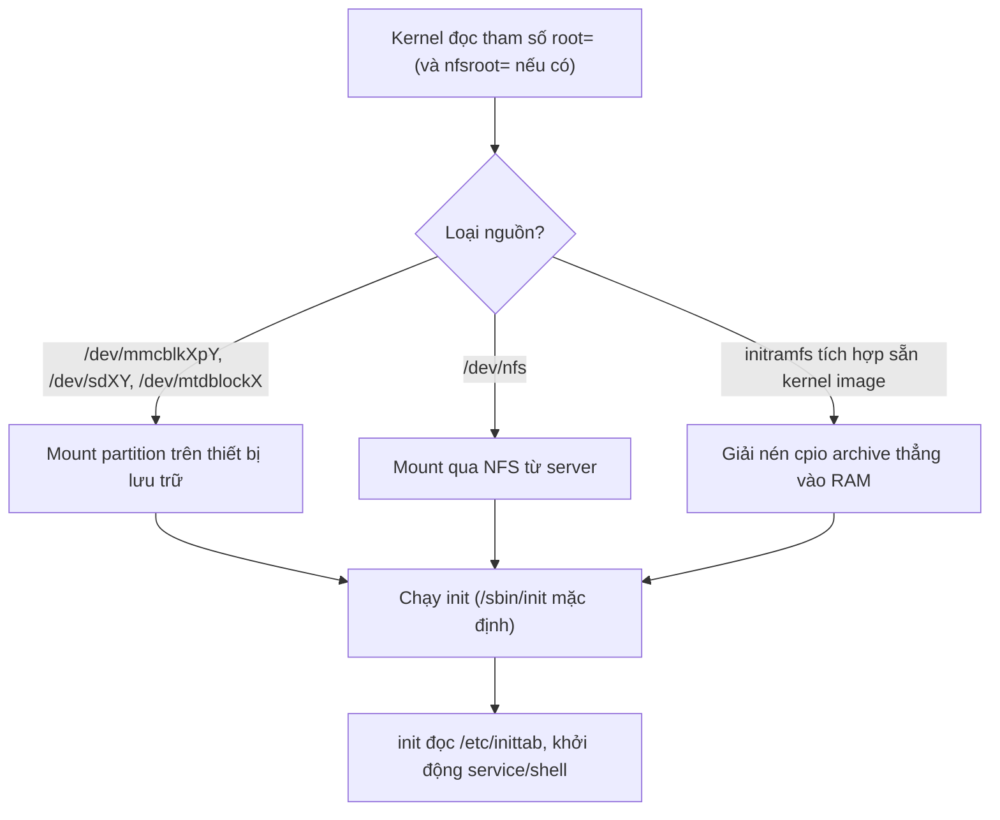

# Root filesystem (rootfs)

!!! note "Tóm tắt"
    Root filesystem là thư mục gốc `/` mà kernel mount đầu tiên khi boot, chứa mọi chương trình,
    thư viện và cấu hình để hệ thống chạy được. Trang này giải thích rootfs gồm những gì, vì sao
    embedded thường dùng BusyBox thay vì các gói GNU rời rạc, và init system khởi động hệ thống
    ra sao.

## Vì sao cần biết cái này

Kernel tự build, boot log chạy đẹp tới dòng "Starting kernel...", rồi kernel panic ngay sau đó vì
không tìm thấy root filesystem — hoặc tệ hơn, mount được nhưng không có gì chạy tiếp vì thiếu
`/sbin/init`. Muốn tự dựng một rootfs tối thiểu từ đầu (không dùng Yocto/Buildroot có sẵn), phải
biết chính xác nó cần những thư mục gì, chương trình gì là bắt buộc, và làm sao nhồi hàng chục
lệnh UNIX cơ bản vào một thiết bị chỉ có vài MB flash.

## Root filesystem là gì

Trong UNIX, mọi ứng dụng nhìn thấy **một cây thư mục duy nhất**, dù dữ liệu thực tế nằm rải rác
trên nhiều thiết bị khác nhau. Mỗi filesystem được **mount** vào một thư mục cụ thể (gọi là mount
point); nội dung thư mục đó phản ánh nội dung filesystem vừa mount, và trống lại khi umount.

Filesystem được mount tại gốc của cây, ký hiệu `/`, gọi là **root filesystem**. Vì `mount` và
`umount` bản thân cũng là chương trình nằm trong một filesystem, chúng không thể tự mount root
filesystem đầu tiên — việc này do kernel làm trực tiếp, dựa vào tham số `root=` trên kernel command
line. Không tìm thấy root filesystem hợp lệ, kernel panic:

```
Please append a correct "root=" boot option
Kernel panic - not syncing: VFS: Unable to mount root fs on unknown block(0,0)
```

## Root filesystem nằm ở đâu

`root=` chấp nhận nhiều loại nguồn:

| Nguồn | Ví dụ `root=` |
|---|---|
| Partition trên SD card / eMMC | `/dev/mmcblk0p2` |
| Partition trên USB key / ổ cứng | `/dev/sda1` |
| Partition trên flash NAND/NOR (MTD) | `/dev/mtdblock3` |
| Qua mạng, NFS | `/dev/nfs` kèm `nfsroot=<ip-server>:<đường-dẫn>` |

Mount qua **NFS** rất tiện lúc phát triển: rootfs nằm ngay trên máy host, sửa file là board thấy
ngay, không cần reflash thẻ SD mỗi lần — cách làm cụ thể xem ở
[U-Boot](u-boot.md#7-boot-qua-mang-tftp-nfs).

Root filesystem cũng có thể nằm hẳn trong RAM dưới dạng **initramfs** — một cpio archive được giải
nén thẳng vào bộ nhớ lúc boot, dùng cho rootfs cực nhỏ hoặc làm bước trung gian trước khi chuyển
sang rootfs thật (chi tiết trình tự này đã nói ở
[Boot flow](boot-flow.md#chang-4-initramfs-tuy-chon)).

## Cấu trúc thư mục

Cách tổ chức thư mục của root filesystem được chuẩn hoá bởi **Filesystem Hierarchy Standard
(FHS)**, để ứng dụng và người dùng thấy cấu trúc quen thuộc trên mọi hệ thống Linux. Một số thư
mục quan trọng:

- `/bin`, `/sbin`, `/lib` — chương trình và thư viện **cơ bản**, cần có ngay cả khi `/usr` chưa
  sẵn sàng (thời trước khi `/usr` hay được mount qua NFS, tách riêng để hệ thống vẫn boot được lúc
  mạng down)
- `/usr/bin`, `/usr/sbin`, `/usr/lib` — chương trình và thư viện **không cơ bản** (mọi thứ còn lại)
- `/etc` — cấu hình toàn hệ thống
- `/dev` — device file, đại diện phần cứng dưới dạng file
- `/proc`, `/sys` — hai **pseudo filesystem**, không chứa dữ liệu thật trên storage mà do kernel
  sinh ra runtime
- `/tmp`, `/var` — file tạm, log, dữ liệu runtime
- `/root`, `/home` — thư mục home của user `root` và của user thường

!!! tip "/usr merge"
    Phân biệt `/bin` với `/usr/bin` giờ phần lớn chỉ còn ý nghĩa lịch sử — các bản phân phối hiện
    đại biến `/bin` thành symlink trỏ sang `/usr/bin` (tương tự `/sbin`, `/lib`), gộp lại làm một
    cho gọn.

`/proc` và `/sys` đáng chú ý riêng vì rất nhiều ứng dụng chuẩn — `ps`, `top`, `udev`/`mdev` — không
chạy được nếu thiếu chúng. `/proc` cho biết thông tin tiến trình và tham số kernel runtime (đọc/ghi
qua `sysctl`, ví dụ `echo 3 > /proc/sys/vm/drop_caches`); `/sys` phản ánh cây device/driver/bus mà
kernel đang quản lý. Cả hai phải tự mount nếu build rootfs từ đầu:

```bash
mount -t proc nodev /proc
mount -t sysfs nodev /sys
```

## Ứng dụng tối thiểu cần có

Có cấu trúc thư mục đúng chưa đủ — rootfs cần tối thiểu ba nhóm chương trình mới thật sự "chạy
được":

1. **init** — chương trình đầu tiên kernel chạy ở user space, sau khi mount root filesystem xong.
   Kernel thử theo `init=` trên command line nếu có; không thì lần lượt `/sbin/init`, `/etc/init`,
   `/bin/init`, `/bin/sh` (riêng trường hợp initramfs chỉ tìm `/init`, hoặc đường dẫn qua
   `rdinit=`). Không tìm được cái nào, kernel panic. init chịu trách nhiệm khởi động mọi service
   còn lại, và làm "cha nuôi" cho tiến trình mồ côi.
2. **Shell** — để chạy script và cho người dùng tương tác.
3. **Basic utility** — `cp`, `mv`, `mkdir`, `cat`, `mount`, `modprobe`, `ip`... dùng trong script
   hệ thống lẫn thao tác tay.

## BusyBox

Trên GNU/Linux thông thường, ba nhóm trên đến từ hàng chục project độc lập — `coreutils`, `bash`,
`grep`, `sed`, `tar`, `wget`, `modutils`... Mỗi project một build system riêng, không thiết kế cho
ràng buộc bộ nhớ/flash nhỏ của embedded.

**BusyBox** giải quyết việc này bằng cách viết lại phần lớn các lệnh UNIX phổ biến, gom vào **một**
project duy nhất, cấu hình được rất chi tiết (bật/tắt từng lệnh, thậm chí từng option của lệnh).
Ra đời năm 1995 để làm hệ thống cài đặt/cứu hộ cho Debian vừa trong một đĩa mềm 1.44MB, giờ được
gọi đùa là "Swiss Army Knife of Embedded Linux". Giấy phép GPLv2; có lựa chọn thay thế là Toybox
(giấy phép BSD).

Cách hoạt động: toàn bộ lệnh được compile chung vào **một executable** duy nhất, `/bin/busybox`.
Mỗi lệnh riêng lẻ (`ls`, `cat`, `ip`...) — gọi là một **applet** — chỉ là một **symlink** trỏ về
`/bin/busybox`; binary tự nhìn `argv[0]` để biết đang được gọi dưới tên nào rồi chạy đúng applet
đó. Với cấu hình đầy đủ vừa phải, toàn bộ chưa tới 1MB (glibc) hoặc dưới 500KB (uClibc, static).

Cấu hình và build BusyBox dùng đúng cơ chế Kconfig quen thuộc từ kernel:

```bash
make defconfig            # cấu hình mặc định, đủ dùng cho user thường
# hoặc: make allnoconfig, rồi tự bật từng option cần
make menuconfig            # tinh chỉnh từng applet, từng option của applet

export CROSS_COMPILE=arm-linux-
make
make install               # tạo cây thư mục + symlink trỏ về busybox
```

`make install` tự sinh cấu trúc `bin/`, `sbin/`, `usr/sbin/`... với toàn bộ symlink cần thiết —
đây chính là khung xương của một rootfs tối thiểu.

### BusyBox init

BusyBox có sẵn applet đóng vai trò **init**, đơn giản hơn nhiều so với SysV init hay systemd trên
desktop/server. Cấu hình bằng một file duy nhất, `/etc/inittab`, mỗi dòng theo cú pháp
`<id>::<action>:<process>`. Ví dụ tối giản:

```
::sysinit:/bin/mount -a
::respawn:/sbin/getty -L ttyS0 115200 vt100
::shutdown:/bin/umount -a -r
```

`respawn` báo BusyBox init tự chạy lại process nếu nó thoát — dùng cho getty giữ console luôn có
người nhận lệnh. Hệ thống lớn hơn, dùng glibc, thường chuyển sang **systemd** để quản lý
dependency giữa các service và chạy song song lúc boot — đánh đổi lấy dung lượng bộ nhớ lớn hơn
nhiều so với BusyBox init.

## Biểu đồ



## Ví dụ

Cây thư mục điển hình sau `make install` của BusyBox — mọi applet chỉ là symlink về cùng một
binary:

```
rootfs/
├── bin/
│   ├── busybox
│   ├── ash -> busybox
│   ├── cat -> busybox
│   ├── ls -> busybox
│   ├── mount -> busybox
│   └── sh -> busybox
├── sbin/
│   ├── init -> ../bin/busybox
│   ├── halt -> ../bin/busybox
│   └── ifconfig -> ../bin/busybox
└── usr/
    └── sbin/
        └── httpd -> ../../bin/busybox
```

## Sai lầm thường gặp

!!! warning "Quên mount /proc và /sys khi tự dựng rootfs bằng tay"
    Có `/sbin/init` chạy được nhưng quên hai dòng `mount -t proc`/`mount -t sysfs` trong script
    khởi động: `ps`, `top`, và cả `udev`/`mdev` (dò thiết bị, tạo node trong `/dev`) im lặng không
    hoạt động hoặc báo lỗi khó hiểu, dù nhìn qua rootfs có vẻ đầy đủ.

!!! warning "Nhầm /bin với /usr/bin lúc build tay"
    Copy binary vào `/usr/bin` nhưng symlink applet BusyBox lại trỏ về `/bin`, hoặc ngược lại —
    `PATH` không thấy lệnh dù file rõ ràng có mặt trên rootfs. Xảy ra chủ yếu khi ghép rootfs thủ
    công mà không dùng thẳng `make install` của BusyBox.

## Liên quan

- **Đọc trước:** [Boot flow](boot-flow.md), [Build kernel](build-kernel.md)
- **Đọc tiếp:** [Truy cập phần cứng từ userspace](userspace-hardware.md),
  [Khái niệm Yocto & BitBake](../03-yocto-bsp/khai-niem.md) — build system tự động hoá việc dựng
  rootfs này thay vì làm tay

---
*Trang này dịch/phóng tác từ phần "Linux Root Filesystem" (mục Filesystems, Root filesystem,
Pseudo Filesystems, Minimal filesystem) và "BusyBox" trong khóa Embedded Linux System Development
của Bootlin, giấy phép CC BY-SA 3.0. Bản gốc: https://bootlin.com/training/embedded-linux.*
