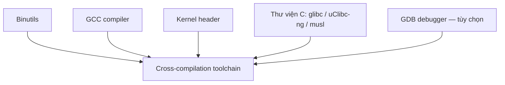

# Toolchain cross-compilation

!!! note "Tóm tắt"
    Toolchain cross-compilation là bộ compiler/binutils/thư viện C chạy trên máy dev (thường x86)
    nhưng sinh ra binary chạy được trên target (ARM, RISC-V...). Trang này giải thích các thành
    phần bên trong một toolchain và vì sao nó cần mang theo một thư mục riêng gọi là sysroot.

## Vì sao cần biết cái này

Lần đầu cross-compile, việc vướng đầu tiên thường là: gõ `gcc` như bình thường thì ra binary x86,
không chạy được trên board ARM. Đổi sang `arm-linux-gnueabihf-gcc` thì chạy, nhưng không hiểu vì
sao tên lệnh dài vậy, và vì sao header/thư viện được link vào không phải từ `/usr/include` quen
thuộc của máy mình mà từ một thư mục lạ gọi là sysroot. Không nắm cấu trúc toolchain thì mỗi lần
đổi board, đổi thư viện C, hay gặp lỗi thiếu symbol lúc chạy là bí, không biết sửa từ đâu.

## Toolchain gốc và toolchain cross-compilation

Toolchain "gốc" (native) là bộ compiler/linker cài sẵn trên máy Linux dev: chạy trên x86, sinh
binary cho chính x86. Với embedded, native toolchain thường không dùng được cho target vì ba lý
do: target hạn chế RAM/storage nên khó tự biên dịch tại chỗ, target chậm hơn máy dev rất nhiều nên
build trực tiếp trên target mất thời gian, và nhiều khi không muốn cài cả bộ dev tool cồng kềnh lên
target. Vì vậy cần **toolchain cross-compilation**: chạy trên host (x86) nhưng sinh binary cho một
kiến trúc target khác.

Lệnh compiler của toolchain cross có tiền tố dài, ví dụ `arm-linux-gnueabihf-gcc`. Đây là một
**tuple kiến trúc**, gồm 3-4 phần cách nhau bằng dấu `-`:

1. Kiến trúc CPU: `arm`, `riscv`, `mips64el`...
2. *(tùy chọn)* Tên vendor — chuỗi tự do
3. Hệ điều hành target: `linux`, hoặc `none` nếu không nhắm hệ điều hành nào — xem khác biệt giữa
   hai loại này ở mục dưới
4. ABI/thư viện C, ví dụ `gnueabihf` (EABI, hard float)

Tiền tố này vừa để build system chọn đúng toolchain, vừa phân biệt lệnh cross với lệnh native
(`gcc` thường).

## Toolchain Linux vs. bare-metal

Phần hệ điều hành trong tuple (`linux` hay `none`) quyết định toolchain build được gì:

- **Toolchain Linux** (tuple có `linux`, vd `arm-linux-gnueabihf`) — có thư viện C sẵn sàng dùng
  syscall Linux nên build được app userspace. Nhưng compiler bên trong vẫn là GCC bình thường,
  không bắt buộc phải link libc, nên toolchain này build được **cả** code bare-metal (firmware,
  bootloader, cả kernel Linux) nếu không link thư viện C vào.
- **Toolchain bare-metal** (tuple có `none`, vd `arm-none-eabi`) — không có thư viện C đầy đủ, hoặc
  chỉ có bản rất tối giản không gắn với OS nào. Chỉ build được code bare-metal, **không** build
  được app Linux vì thiếu libc thật.

Nói cách khác, toolchain Linux là tập lớn hơn, bao trùm cả hai việc — đây là lý do một dự án có thể
dùng cùng một toolchain `arm-linux-gnueabihf` để vừa build app, vừa build U-Boot hay kernel, thay vì
phải có riêng một toolchain bare-metal.

## Các thành phần bên trong toolchain



- **Binutils** — bộ công cụ thao tác binary ELF: `as` (assembler), `ld` (linker), `ar`/`ranlib`
  (đóng gói static library `.a`), `objdump`/`readelf`/`nm`/`size` (soi binary), `objcopy`, `strip`.
- **GCC** — compiler chính, biên dịch C/C++ (và nhiều ngôn ngữ khác: Fortran, Ada, Go...) ra mã
  máy. GCC hỗ trợ rất nhiều kiến trúc CPU (x86, ARM, RISC-V...) nhưng mỗi lần build, GCC chỉ nhắm
  một kiến trúc cố định — đây là lý do phải có toolchain riêng cho từng kiến trúc target.
- **Kernel header** — struct, hằng số, số hiệu system call mà kernel expose ra user space (ví dụ
  `__NR_read` trong `<asm/unistd.h>`). Nằm trong `<linux/...>` và `<asm/...>` của toolchain, tương
  ứng đúng với `include/uapi/` và `arch/<arch>/include/uapi/` trong source kernel — cần tra header
  gốc thì vào đúng hai thư mục này. Thư viện C cần các header này lúc build, app cũng cần khi gọi
  thẳng syscall. Header được trích từ chính source kernel bằng target `headers_install`, nên
  toolchain build bằng header cũ hơn kernel đang chạy trên target vẫn hoạt động bình thường —
  kernel giữ tương thích ngược, chỉ là không dùng được API/syscall mới thêm sau đó.
- **Thư viện C chuẩn** — lớp API giữa app và kernel: chương trình gọi hàm chuẩn như `printf`,
  `malloc`, thư viện C bên dưới mới gọi thẳng syscall Linux. Chọn thư viện nào ngay lúc build
  toolchain, vì GCC được biên dịch link cứng với một thư viện cụ thể, không đổi được sau. `glibc`
  đầy đủ tính năng nhất, hợp để dev/debug ban đầu. `uClibc-ng`/`musl` nhỏ gọn hơn cho hệ giới hạn
  dung lượng — `uClibc-ng` còn là thư viện C duy nhất hỗ trợ ARM không có MMU (Cortex-M...), còn
  `musl` license MIT nên dễ build binary tĩnh hơn `glibc` (LGPL). Lợi thế "nhỏ gọn" của
  `uClibc-ng`/`musl` với dung lượng lưu trữ hiện nay không còn quan trọng như trước, chủ yếu còn ý
  nghĩa khi tối ưu boot time hoặc giảm kích thước rootfs/container image. Các thư viện C rất nhỏ
  như `newlib`/`klibc` không implement đủ POSIX, chỉ hợp chương trình rất đơn giản.
- **GDB** — debugger, thường đi kèm nhưng không bắt buộc.

Phần lớn dự án Embedded Linux dùng bộ GNU như trên (GCC + Binutils + GDB). Có một hệ thay thế là
**LLVM** (Clang compiler, LLD linker, LLDB debugger) — license MIT/BSD, chưa phổ biến bằng GNU
trong embedded Linux nhưng đáng biết vì một số dự án lớn đã chuyển sang dùng.

## ABI, floating point và cờ tối ưu CPU

Ba lựa chọn này cố định ngay lúc build toolchain, ảnh hưởng trực tiếp tới việc binary có chạy được
trên target hay không.

**ABI** (Application Binary Interface) quy định cách các binary trong hệ thống "nói chuyện" với
nhau ở mức nhị phân: cách truyền tham số hàm, cách trả về giá trị, cách gọi system call, cách xếp
field trong struct (alignment...). Toàn bộ binary chạy chung trên một hệ thống — app, thư viện,
cả kernel — phải cùng một ABI, nếu không sẽ đọc sai dữ liệu của nhau dù không có lỗi biên dịch nào.
Trên ARM 32-bit có hai ABI chính: EABI và EABIhf (chữ `hf` trong `gnueabihf` chính là từ đây).

**Floating point** — với CPU không có FPU (floating point unit) trong phần cứng, có hai cách xử lý
phép tính dấu phẩy động:

- **hard float** — vẫn sinh mã dùng lệnh FPU, để kernel tự emulate lúc chạy. Rất chậm.
- **soft float** — sinh mã gọi hàm thư viện phần mềm thay vì lệnh FPU.

Đây là ý nghĩa thật của "hard float"/"soft float" trong tên toolchain. CPU có sẵn FPU thì gần như
luôn chọn hard float vì nhanh hơn nhiều.

**Cờ tối ưu CPU** — GCC chỉ build cho một kiến trúc cố định, nhưng bên trong kiến trúc đó vẫn có
tùy chọn tinh hơn: `-march` chọn tập lệnh cụ thể, `-mtune` tối ưu lịch lệnh cho đúng CPU, `-mcpu`
gộp cả hai (vd `-mcpu=cortex-a8` ngầm định `-march=armv7 -mtune=cortex-a8`). Giá trị này chọn sẵn
lúc build toolchain, trở thành mặc định khi không truyền flag nào khác.

## sysroot — "hệ thống file" thu nhỏ của target

Toolchain cross không dùng `/usr/include` hay `/usr/lib` của máy dev — đó là header/lib cho x86,
không tương thích target. Thay vào đó, toolchain mang theo **sysroot**: một thư mục con mô phỏng
root filesystem của target.

```
<tên-toolchain>/
├── bin/                        # arm-linux-gnueabihf-gcc, -ld, -objdump... (nên thêm vào PATH)
└── <arch-tuple>/sysroot/
    ├── lib/                    # libc, GCC runtime, libstdc++ đã biên dịch sẵn cho target
    └── usr/include/            # header thư viện C + kernel header, cho đúng target
```

Khi cross-compile, GCC tự trỏ include-path/lib-path vào sysroot này thay vì thư mục hệ thống của
máy dev — đây là lý do `#include <stdio.h>` lấy đúng header của target dù build trên x86. Đôi khi
`bin/` còn có thêm symlink tên ngắn, vd `arm-linux-gcc` trỏ tới tên đầy đủ
`arm-cortexa7-linux-uclibcgnueabihf-gcc`, cho gõ lệnh đỡ dài.

## Ví dụ

Tải một toolchain prebuilt của ARM, biên dịch thử một file `.c` rồi soi binary sinh ra:

```bash
$ wget https://developer.arm.com/-/media/Files/downloads/gnu-a/10.3-2021.07/binrel/gcc-arm-10.3-2021.07-x86_64-arm-none-linux-gnueabihf.tar.xz
$ tar xf gcc-arm-10.3-2021.07-x86_64-arm-none-linux-gnueabihf.tar.xz
$ cd gcc-arm-10.3-2021.07-x86_64-arm-none-linux-gnueabihf/

$ ./bin/arm-none-linux-gnueabihf-gcc -o hello hello.c

$ file hello
hello: ELF 32-bit LSB executable, ARM, EABI5 version 1 (SYSV), dynamically linked,
interpreter /lib/ld-linux-armhf.so.3, for GNU/Linux 3.2.0, with debug_info, not stripped
```

`file` xác nhận đúng những gì mong đợi: kiến trúc ARM, EABI5 (hard-float), và `interpreter` — bản
dynamic linker chạy lúc runtime — là bản dành cho ARM, không phải bản x86 của máy dev.

## Lấy toolchain ở đâu

- **Tải sẵn (prebuilt)** — nhanh nhất, không tùy chỉnh được: gói của distro (vd Ubuntu
  `gcc-arm-linux-gnueabihf`, thường chỉ có glibc), toolchain chính thức của ARM, hoặc kho toolchain
  nhiều kiến trúc/libc của Bootlin tại `toolchains.bootlin.com`. Trước khi tải, kiểm tra kỹ: kiến
  trúc CPU, endianness, thư viện C, version kernel header, ABI, hard hay soft float — sai một
  trong các mục này là toolchain không dùng được cho target.
- **Build bằng công cụ tự động** — linh hoạt hơn, tự chọn libc/ABI/version, còn build lại được nếu
  cần vá lỗi hoặc lỗ hổng bảo mật. `Crosstool-NG` cấu hình kiểu `menuconfig`:

  ```bash
  $ git clone https://github.com/crosstool-ng/crosstool-ng.git && cd crosstool-ng
  $ ./bootstrap && ./configure --enable-local && make
  $ ./ct-ng menuconfig   # chọn kiến trúc, libc, ABI...
  $ ./ct-ng build        # kết quả nằm ở $HOME/x-tools/
  ```

  Ngoài ra, các build system dựng rootfs cũng build được toolchain riêng: Buildroot (`make sdk`,
  hỗ trợ glibc/uClibc/musl), Yocto (hỗ trợ glibc/musl), PTXdist (hỗ trợ glibc/uClibc).
- **Build tay hoàn toàn** — khả thi nhưng phức tạp (binutils → GCC stage 1 bare-metal → kernel
  header → libc → GCC stage 2 final), ít khi cần tự làm trừ khi muốn hiểu sâu.

## Sai lầm thường gặp

Trộn toolchain: build app bằng toolchain glibc/hard-float nhưng rootfs trên target lại dựng bằng
musl hoặc soft-float — build không báo lỗi gì, nhưng lúc chạy trên board thì thiếu symbol hoặc
segfault khó hiểu. Toolchain build app và toolchain/build system dựng rootfs phải khớp cùng thư
viện C, cùng ABI.

## Liên quan

- **Đọc tiếp:** [Boot flow](boot-flow.md) — sau khi có toolchain, bước tiếp theo là hiểu quá trình
  board khởi động, để biết bootloader/kernel do toolchain này build ra sẽ chạy thế nào

---
*Trang này dịch/phóng tác từ slide "Cross-compiling toolchains" trong khóa Embedded Linux System
Development của Bootlin, giấy phép CC BY-SA 3.0. Bản gốc: https://bootlin.com/training/embedded-linux.*
