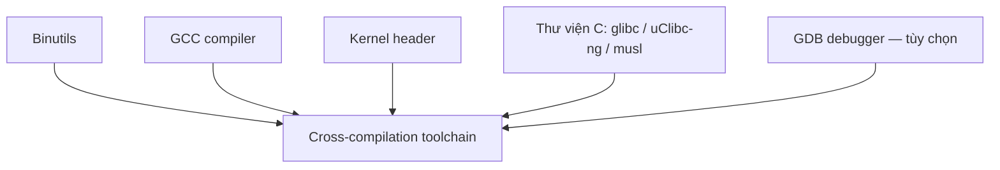

# Toolchain cross-compilation

!!! note "Tóm tắt"
    Toolchain cross-compilation là bộ compiler/binutils/thư viện C chạy trên máy dev (thường x86)
    nhưng sinh ra binary chạy được trên target (ARM, RISC-V...). Trang này giải thích các thành
    phần bên trong một toolchain và vì sao nó cần mang theo một thư mục riêng gọi là sysroot.

## Vì sao cần biết cái này

Lần đầu cross-compile, việc vướng đầu tiên thường là: gõ `gcc` như bình thường thì ra binary x86,
không chạy được trên board ARM. Đổi sang `arm-linux-gnueabihf-gcc` thì chạy, nhưng không hiểu vì
sao tên lệnh dài vậy, và vì sao header/thư viện được link vào không phải từ `/usr/include` quen
thuộc của máy mình mà từ một thư mục lạ gọi là sysroot. Không nắm cấu trúc toolchain thì mỗi lần
đổi board, đổi thư viện C, hay gặp lỗi thiếu symbol lúc chạy là bí, không biết sửa từ đâu.

## Toolchain gốc và toolchain cross-compilation

Toolchain "gốc" (native) là bộ compiler/linker cài sẵn trên máy Linux dev: chạy trên x86, sinh
binary cho chính x86. Với embedded, target thường không đủ RAM/storage để tự biên dịch, lại chạy
kiến trúc CPU khác hẳn máy dev. Vì vậy cần **toolchain cross-compilation**: chạy trên host (x86)
nhưng sinh binary cho một kiến trúc target khác.

Lệnh compiler của toolchain cross có tiền tố dài, ví dụ `arm-linux-gnueabihf-gcc`. Đây là một
**tuple kiến trúc**, gồm 3-4 phần cách nhau bằng dấu `-`:

1. Kiến trúc CPU: `arm`, `riscv`, `mips64el`...
2. *(tùy chọn)* Tên vendor — chuỗi tự do
3. Hệ điều hành target: `linux`, hoặc `none` nếu không nhắm hệ điều hành nào (toolchain
   bare-metal, dùng cho firmware/bootloader thay vì app Linux)
4. ABI/thư viện C, ví dụ `gnueabihf` (EABI, hard float)

Tiền tố này vừa để build system chọn đúng toolchain, vừa phân biệt lệnh cross với lệnh native
(`gcc` thường).

## Các thành phần bên trong toolchain



- **Binutils** — bộ công cụ thao tác binary ELF: `as` (assembler), `ld` (linker), `ar`/`ranlib`
  (đóng gói static library `.a`), `objdump`/`readelf`/`nm`/`size` (soi binary), `objcopy`, `strip`.
- **GCC** — compiler chính, biên dịch C/C++ ra mã máy cho kiến trúc target.
- **Kernel header** — struct, hằng số, số hiệu system call mà kernel expose ra user space (ví dụ
  `__NR_read` trong `<asm/unistd.h>`). Thư viện C cần các header này lúc build, app cũng cần khi
  gọi thẳng syscall. Header được trích từ chính source kernel bằng target `headers_install`, nên
  toolchain build bằng header cũ hơn kernel đang chạy trên target vẫn hoạt động bình thường —
  kernel giữ tương thích ngược, chỉ là không dùng được API/syscall mới thêm sau đó.
- **Thư viện C chuẩn** — chọn ngay lúc build toolchain, vì GCC được biên dịch link cứng với một
  thư viện cụ thể, không đổi được sau. `glibc` đầy đủ tính năng nhất, hợp để dev/debug ban đầu.
  `uClibc-ng`/`musl` nhỏ gọn hơn cho hệ giới hạn dung lượng; `musl` license MIT nên dễ build
  binary tĩnh hơn `glibc` (LGPL). Các thư viện C rất nhỏ như `newlib`/`klibc` không implement đủ
  POSIX, chỉ hợp chương trình rất đơn giản.
- **GDB** — debugger, thường đi kèm nhưng không bắt buộc.

## sysroot — "hệ thống file" thu nhỏ của target

Toolchain cross không dùng `/usr/include` hay `/usr/lib` của máy dev — đó là header/lib cho x86,
không tương thích target. Thay vào đó, toolchain mang theo **sysroot**: một thư mục con mô phỏng
root filesystem của target.

```
<tên-toolchain>/
├── bin/                        # arm-linux-gnueabihf-gcc, -ld, -objdump... (nên thêm vào PATH)
└── <arch-tuple>/sysroot/
    ├── lib/                    # libc, GCC runtime, libstdc++ đã biên dịch sẵn cho target
    └── usr/include/            # header thư viện C + kernel header, cho đúng target
```

Khi cross-compile, GCC tự trỏ include-path/lib-path vào sysroot này thay vì thư mục hệ thống của
máy dev — đây là lý do `#include <stdio.h>` lấy đúng header của target dù build trên x86.

## Lấy toolchain ở đâu

- **Tải sẵn (prebuilt)** — nhanh nhất, không tùy chỉnh được: gói của distro (vd Ubuntu
  `gcc-arm-linux-gnueabihf`, thường chỉ có glibc), toolchain chính thức của ARM, hoặc kho toolchain
  nhiều kiến trúc/libc của Bootlin tại `toolchains.bootlin.com`.
- **Build bằng công cụ tự động** — linh hoạt hơn, tự chọn libc/ABI/version: `Crosstool-NG` (cấu
  hình kiểu `menuconfig`), hoặc build system rootfs như Buildroot (`make sdk`), Yocto.
- **Build tay hoàn toàn** — khả thi nhưng phức tạp (binutils → GCC stage 1 bare-metal → kernel
  header → libc → GCC stage 2 final), ít khi cần tự làm trừ khi muốn hiểu sâu.

## Sai lầm thường gặp

Trộn toolchain: build app bằng toolchain glibc/hard-float nhưng rootfs trên target lại dựng bằng
musl hoặc soft-float — build không báo lỗi gì, nhưng lúc chạy trên board thì thiếu symbol hoặc
segfault khó hiểu. Toolchain build app và toolchain/build system dựng rootfs phải khớp cùng thư
viện C, cùng ABI.

## Liên quan

- **Đọc tiếp:** [Boot flow](boot-flow.md) — sau khi có toolchain, bước tiếp theo là hiểu quá trình
  board khởi động, để biết bootloader/kernel do toolchain này build ra sẽ chạy thế nào

---
*Trang này dịch/phóng tác từ slide "Cross-compiling toolchains" trong khóa Embedded Linux System
Development của Bootlin, giấy phép CC BY-SA 3.0. Bản gốc: https://bootlin.com/training/embedded-linux.*
