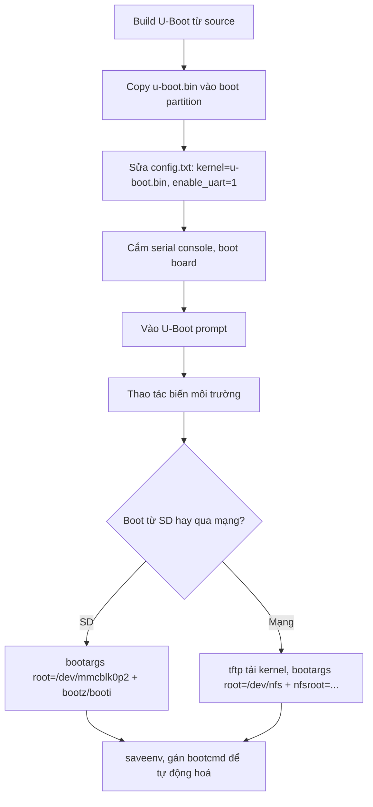

# U-Boot: prompt, môi trường và boot qua mạng

!!! note "Mục tiêu"
    Sau bài này, cậu vào được U-Boot prompt qua serial console, đọc/ghi biến môi trường
    (`printenv`, `setenv`, `saveenv`), tự đặt `bootargs`/`bootcmd` để board tự boot kernel, tải
    kernel qua TFTP và mount root filesystem qua NFS, và build được U-Boot từ source cho
    Raspberry Pi.

## Chuẩn bị

- Phần cứng: Raspberry Pi [ĐIỀN: model cụ thể — 3B/4B/Zero 2 W...], cáp USB-to-serial nối vào
  chân UART (RPi không đưa UART ra cổng nào có sẵn, phải câu trực tiếp vào GPIO), thẻ SD, cáp
  Ethernet nếu làm phần TFTP/NFS
- Đã cài/build trước đó: toolchain cross-compile — xem [Toolchain](toolchain.md); thẻ SD đã có
  partition boot FAT32 theo chuẩn Raspberry Pi OS
- Khái niệm nên đọc trước: [Boot flow](boot-flow.md) — trang này giả định đã biết U-Boot là
  bootloader giai đoạn 2 nằm ở đâu trong chuỗi boot

## Sơ đồ luồng thao tác



## Các bước

### 1. Build U-Boot từ source

U-Boot dùng hệ cấu hình kconfig giống kernel Linux: chọn file `defconfig` khớp board, build ra
`.config`, rồi build binary.

```bash
git clone https://gitlab.denx.de/u-boot/u-boot.git
cd u-boot
ls configs/ | grep -i rpi          # tìm đúng tên defconfig cho model đang dùng

export CROSS_COMPILE=aarch64-linux-gnu-   # hoặc arm-linux-gnueabihf- nếu build 32-bit
make [ĐIỀN: tên_defconfig]
make -j$(nproc)
```

Kết quả chính là `u-boot.bin`. Muốn bật thêm command hay driver thì chạy `make menuconfig`
trước bước build cuối.

### 2. Cài U-Boot vào thẻ SD

Raspberry Pi không có ROM code đọc chân boot kiểu STM32/i.MX — GPU boot riêng, đọc `config.txt`
trên partition FAT32 đầu tiên để biết file nào là "kernel" cần load. Chainload U-Boot bằng cách
copy `u-boot.bin` vào đó và trỏ `kernel=` sang nó:

```bash
cp u-boot.bin /boot/firmware/    # đường dẫn mount thật tùy bản Raspberry Pi OS đang dùng
```

Thêm vào `config.txt`:

```
kernel=u-boot.bin
enable_uart=1
```

`enable_uart=1` cần thiết để thấy log qua UART — mặc định GPU firmware có thể không bật nó.

### 3. Vào U-Boot prompt

Cắm cáp USB-to-serial vào chân UART, mở serial console trên host (`picocom`, `minicom`...) với
baud rate [ĐIỀN: baud rate thật in trong banner, thường 115200]. Cắm điện board, nhấn phím bất
kỳ khi thấy đếm ngược để dừng autoboot.

```
[ĐIỀN: banner U-Boot thật khi board khởi động — phiên bản, ngày build, thông tin board]
```

### 4. Xem thông tin board và lệnh có sẵn

```
=> help
=> version
=> bdinfo
```

`bdinfo` cho biết vùng RAM khả dụng — cần khi tự chọn địa chỉ load kernel/DTB bằng tay.

### 5. Thao tác biến môi trường

```
=> printenv                       # xem toàn bộ
=> printenv ipaddr                # xem một biến
=> setenv ipaddr 192.168.1.111    # đổi trong RAM, mất khi mất điện
=> saveenv                        # ghi xuống storage để giữ lại
```

`setenv`/`editenv` chỉ sửa trong RAM — không chạy `saveenv` thì mọi thay đổi mất sau lần reset
kế tiếp.

### 6. Đặt bootargs, boot kernel từ thẻ SD

```
=> load mmc 0:1 ${kernel_addr_r} Image      # hoặc zImage + bootz nếu build 32-bit
=> load mmc 0:1 ${fdt_addr_r} [ĐIỀN: tên-file.dtb]
=> setenv bootargs console=ttyS0,115200 root=/dev/mmcblk0p2 rootwait
=> booti ${kernel_addr_r} - ${fdt_addr_r}
```

Boot được rồi thì gộp lại thành một `bootcmd` để board tự chạy sau đếm ngược, khỏi gõ tay mỗi
lần:

```
=> setenv bootcmd 'load mmc 0:1 ${kernel_addr_r} Image; load mmc 0:1 ${fdt_addr_r} [ĐIỀN].dtb; booti ${kernel_addr_r} - ${fdt_addr_r}'
=> saveenv
```

### 7. Boot qua mạng: TFTP + NFS

Trên host (Linux):

```bash
sudo apt install tftpd-hpa nfs-kernel-server
sudo cp Image /srv/tftp/                       # kernel image build cho board
echo "/home/[user]/rootfs 192.168.1.111(rw,no_root_squash,no_subtree_check)" | sudo tee -a /etc/exports
sudo exportfs -r
```

Trên U-Boot:

```
=> setenv ipaddr 192.168.1.111
=> setenv serverip 192.168.1.110
=> tftp ${kernel_addr_r} Image
=> setenv bootargs console=ttyS0,115200 root=/dev/nfs ip=192.168.1.111 nfsroot=192.168.1.110:/home/[user]/rootfs,nfsvers=3,tcp
=> booti ${kernel_addr_r} - ${fdt_addr_r}
```

`root=/dev/nfs` báo kernel mount root filesystem qua NFS thay vì thiết bị block; kernel cần
build sẵn `CONFIG_NFS_FS`, `CONFIG_ROOT_NFS`, `CONFIG_IP_PNP` thì việc này mới chạy được — xem
[Build kernel](build-kernel.md).

!!! tip "Vì sao đáng làm dù đã boot được từ SD"
    NFS root cho sửa file trên host rồi thấy hiệu lực ngay trên board, không cần rebuild
    image/reflash thẻ SD mỗi lần đổi vài dòng — rất đáng dùng trong lúc phát triển driver hay
    rootfs, chuyển lại SD/eMMC khi đóng gói sản phẩm cuối.

## Kiểm tra kết quả

Boot xong, dò log kernel xác nhận mount root đúng loại đã chọn:

```
[ĐIỀN: dòng log thật, ví dụ "VFS: Mounted root (nfs filesystem) readonly on device 0:17"
hoặc tương ứng khi mount từ mmcblk]
```

Vào được shell trên board và `mount | grep " / "` ra đúng nguồn rootfs đã cấu hình là xác nhận
chắc chắn nhất.

## Mở rộng

- Thay vì gõ tay từng lệnh, U-Boot hỗ trợ **Generic Distro boot**: đọc file
  `/boot/extlinux/extlinux.conf` và tự load kernel/DTB/bootargs từ đó — chuẩn hoá hành vi boot
  giữa nhiều board thay vì mỗi board một `bootcmd` riêng thủ công. Xem thêm ở
  [Boot flow](boot-flow.md).
- Nếu update U-Boot thường xuyên trong lúc phát triển, thử công cụ
  [Snagboot](https://github.com/bootlin/snagboot) của Bootlin để nạp lại qua USB mà không cần
  tháo thẻ SD.

## Liên quan

- **Đọc trước:** [Boot flow](boot-flow.md), [Toolchain](toolchain.md)
- **Bước tiếp theo:** [Build kernel](build-kernel.md), [Device Tree](device-tree.md)

---
*Trang này dịch/phóng tác từ phần "The U-boot bootloader" trong khóa Embedded Linux System
Development của Bootlin, giấy phép CC BY-SA 3.0. Bản gốc: https://bootlin.com/training/embedded-linux.*
