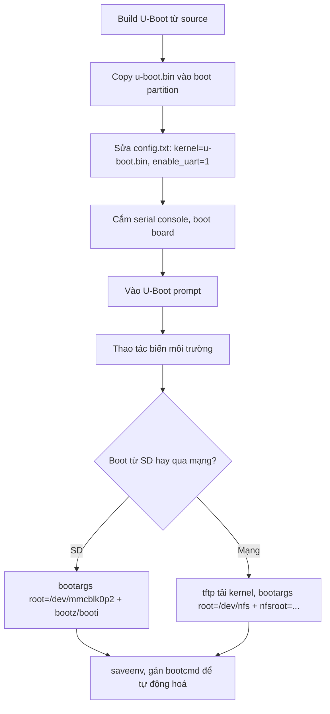

# U-Boot: prompt, môi trường và boot qua mạng

!!! note "Mục tiêu"
    Sau bài này, cậu vào được U-Boot prompt qua serial console, đọc/ghi biến môi trường
    (`printenv`, `setenv`, `saveenv`), tự đặt `bootargs`/`bootcmd` để board tự boot kernel, tải
    kernel qua TFTP và mount root filesystem qua NFS, và build được U-Boot từ source cho
    Raspberry Pi.

## Chuẩn bị

- Phần cứng: Raspberry Pi [ĐIỀN: model cụ thể — 3B/4B/Zero 2 W...], cáp USB-to-serial nối vào
  chân UART (RPi không đưa UART ra cổng nào có sẵn, phải câu trực tiếp vào GPIO), thẻ SD, cáp
  Ethernet nếu làm phần TFTP/NFS
- Đã cài/build trước đó: toolchain cross-compile — xem [Toolchain](toolchain.md); thẻ SD đã có
  partition boot FAT32 theo chuẩn Raspberry Pi OS
- Khái niệm nên đọc trước: [Boot flow](boot-flow.md) — trang này giả định đã biết U-Boot là
  bootloader giai đoạn 2 nằm ở đâu trong chuỗi boot, và khái niệm SPL (bootloader giai đoạn 1 rút
  gọn, không có shell) đã nói ở đó

## Sơ đồ luồng thao tác



## Các bước

### 1. Build U-Boot từ source

U-Boot dùng hệ cấu hình kconfig giống kernel Linux: chọn file `defconfig` khớp board, build ra
`.config`, rồi build binary.

```bash
git clone https://gitlab.denx.de/u-boot/u-boot.git
cd u-boot
ls configs/ | grep -i rpi          # tìm đúng tên defconfig cho model đang dùng

export CROSS_COMPILE=aarch64-linux-gnu-   # hoặc arm-linux-gnueabihf- nếu build 32-bit
make [ĐIỀN: tên_defconfig]
make -j$(nproc)
```

Kết quả chính là `u-boot.bin`. Muốn bật thêm command hay driver thì chạy `make menuconfig`
trước bước build cuối. Cần đổi Device Tree mà chính U-Boot dùng lúc chạy (khác DTB truyền cho
kernel ở bước 6) thì thêm `DEVICE_TREE=<tên>` vào lệnh `make` — vị trí file `.dts` tương ứng phụ
thuộc `CONFIG_OF_UPSTREAM` trong defconfig.

!!! tip "Lấy source ở đâu"
    Ưu tiên clone thẳng từ upstream (`gitlab.denx.de/u-boot/u-boot`) nếu board đã được hỗ trợ —
    chất lượng tốt hơn, được cộng đồng review, cập nhật đều đặn. Fork riêng của vendor SoC/board
    thường cũ hơn, ít được review, chỉ nên dùng khi upstream chưa hỗ trợ phần cứng.

### 2. Cài U-Boot vào thẻ SD

Raspberry Pi không có ROM code đọc chân boot kiểu STM32/i.MX — GPU boot riêng, đọc `config.txt`
trên partition FAT32 đầu tiên để biết file nào là "kernel" cần load. Chainload U-Boot bằng cách
copy `u-boot.bin` vào đó và trỏ `kernel=` sang nó:

```bash
cp u-boot.bin /boot/firmware/    # đường dẫn mount thật tùy bản Raspberry Pi OS đang dùng
```

Thêm vào `config.txt`:

```
kernel=u-boot.bin
enable_uart=1
```

`enable_uart=1` cần thiết để thấy log qua UART — mặc định GPU firmware có thể không bật nó.

### 3. Vào U-Boot prompt

Cắm cáp USB-to-serial vào chân UART, mở serial console trên host (`picocom`, `minicom`...) với
baud rate [ĐIỀN: baud rate thật in trong banner, thường 115200]. Cắm điện board, nhấn phím bất
kỳ khi thấy đếm ngược để dừng autoboot.

```
[ĐIỀN: banner U-Boot thật khi board khởi động — phiên bản, ngày build, thông tin board]
```

### 4. Xem thông tin board, lệnh có sẵn và bộ nhớ

```
=> help
=> version
=> bdinfo
```

U-Boot không có cơ chế tự cấp phát bộ nhớ — mọi địa chỉ dùng trong lệnh `load`/`boot*` là địa chỉ
vật lý trực tiếp, tự chọn. `bdinfo` cho biết vùng RAM khả dụng (`DRAM bank`) và `relocaddr` — nơi
chính U-Boot đang chạy, thường ở cuối RAM, tránh ghi đè lên đó. Đây là lý do nên dùng các biến
`kernel_addr_r`/`fdt_addr_r` có sẵn (bước 6) thay vì tự chọn địa chỉ tay.

Ngoài `help`, có thêm lệnh đọc/ghi trực tiếp một vùng nhớ — hữu ích khi debug dữ liệu load sai
chỗ hoặc đọc thanh ghi phần cứng qua MMIO:

```
=> md c0000000 10      # memory display: đọc 0x10 word từ địa chỉ 0xc0000000
=> mw c0000000 1 4      # memory write: ghi giá trị 1 vào 4 word liên tiếp
```

### 5. Thao tác biến môi trường

```
=> printenv                       # xem toàn bộ
=> printenv ipaddr                # xem một biến
=> setenv ipaddr 192.168.1.111    # đổi trong RAM, mất khi mất điện
=> saveenv                        # ghi xuống storage để giữ lại
```

`setenv`/`editenv` chỉ sửa trong RAM — không chạy `saveenv` thì mọi thay đổi mất sau lần reset kế
tiếp. (Có thêm nhóm lệnh `env` — `env save`, `env default`, `env erase`... — làm cùng việc, chỉ
khác cú pháp gọi.)

!!! warning "`saveenv` báo lỗi thì kiểm tra cấu hình lưu trữ, không phải thẻ SD"
    U-Boot phải được build với nơi lưu environment cụ thể (offset trên MMC/NAND, file trên FAT/
    ext4, volume UBI...) qua `menuconfig` → *Environment*. Nhiều defconfig mặc định **không bật**
    lưu persistent — gặp lỗi ở `saveenv` thì đây là nguyên nhân đầu tiên cần xem lại.

### 6. Đặt bootargs, boot kernel từ thẻ SD

`kernel_addr_r`/`fdt_addr_r` không phải địa chỉ tự nghĩ ra — đây là biến chuẩn của quy ước
*Generic Distro boot*, định nghĩa sẵn trong defconfig của board, trỏ tới vùng RAM an toàn để nạp
dữ liệu (xem lại bước 4).

```
=> load mmc 0:1 ${kernel_addr_r} Image      # hoặc zImage + bootz nếu build 32-bit
=> load mmc 0:1 ${fdt_addr_r} [ĐIỀN: tên-file.dtb]
=> setenv bootargs console=ttyS0,115200 root=/dev/mmcblk0p2 rootwait
=> booti ${kernel_addr_r} - ${fdt_addr_r}
```

Boot được rồi thì gộp lại thành một `bootcmd` để board tự chạy sau đếm ngược, khỏi gõ tay mỗi
lần. Các lệnh nối bằng `;`; `bootcmd` cũng dùng được rẽ nhánh `if <lệnh>; then ...; else ...; fi`,
gọi script khác bằng `run <tên-biến>`, và tham chiếu biến bằng `$tên-biến` — đây là cơ chế nền của
mọi `bootcmd` phức tạp gặp trên board thật, không chỉ ví dụ đơn giản dưới đây:

```
=> setenv bootcmd 'load mmc 0:1 ${kernel_addr_r} Image; load mmc 0:1 ${fdt_addr_r} [ĐIỀN].dtb; booti ${kernel_addr_r} - ${fdt_addr_r}'
=> saveenv
```

!!! warning "Đặt đúng bootargs mà kernel vẫn như không nhận"
    U-Boot ghi `bootargs` vào node `/chosen` của Device Tree ngay trước khi nhảy vào kernel.
    Nhưng nếu kernel build với `CONFIG_CMDLINE_FORCE`, nó bỏ qua hoàn toàn command line từ
    bootloader, chỉ dùng chuỗi đã đóng cứng lúc build (`CONFIG_CMDLINE`). Muốn U-Boot toàn quyền
    quyết định thì kernel phải build với `CONFIG_CMDLINE_FROM_BOOTLOADER` — xem
    [Build kernel](build-kernel.md).

Ngoài `load` (đọc theo file, tự nhận filesystem), U-Boot còn có lệnh riêng theo từng loại
filesystem (`fatload`, `ext4load`, `ls`, `size`) và lệnh thao tác thô theo block/partition
(`mmc part` liệt kê bảng partition, `mmc read`/`mmc write` đọc/ghi thẳng theo block) — dùng khi
cần can thiệp ở mức thấp hơn file, ví dụ tự flash một partition cụ thể.

### 7. Boot qua mạng: TFTP + NFS

Trên host (Linux):

```bash
sudo apt install tftpd-hpa nfs-kernel-server
sudo cp Image /srv/tftp/                       # kernel image build cho board
echo "/home/[user]/rootfs 192.168.1.111(rw,no_root_squash,no_subtree_check)" | sudo tee -a /etc/exports
sudo exportfs -r
```

`rw` cho ghi thay vì chỉ đọc, `no_root_squash` giữ nguyên quyền root từ client thay vì ánh xạ về
user ẩn danh (cần thiết vì `init` trên target chạy bằng root), `no_subtree_check` tắt kiểm tra
subtree — tránh lỗi khi export không phải toàn bộ filesystem.

Trên U-Boot, lấy IP tự động thay vì gõ tay bằng:

```
=> dhcp                           # xin ipaddr/serverip/netmask qua DHCP
```

hoặc đặt tay như dưới. Lưu ý `ping` từ máy host vào U-Boot **không hoạt động** — U-Boot không đa
nhiệm/không xử lý ngắt như một OS thật, chỉ `ping` từ U-Boot ra ngoài mới dùng được để kiểm tra
kết nối:

```
=> setenv ipaddr 192.168.1.111
=> setenv serverip 192.168.1.110
=> tftp ${kernel_addr_r} Image
=> setenv bootargs console=ttyS0,115200 root=/dev/nfs ip=192.168.1.111 nfsroot=192.168.1.110:/home/[user]/rootfs,nfsvers=3,tcp
=> booti ${kernel_addr_r} - ${fdt_addr_r}
```

`nfsvers=3,tcp` vì nhiều bản Linux hiện đại chặn NFS client dùng NFSv2/UDP theo mặc định — thiếu
cờ này dễ gặp mount timeout khó hiểu. `root=/dev/nfs` báo kernel mount root filesystem qua NFS
thay vì thiết bị block; kernel cần build sẵn `CONFIG_NFS_FS`, `CONFIG_ROOT_NFS`,
`CONFIG_IP_PNP` thì việc này mới chạy được — xem [Build kernel](build-kernel.md).

!!! tip "Vì sao đáng làm dù đã boot được từ SD"
    NFS root cho sửa file trên host rồi thấy hiệu lực ngay trên board, không cần rebuild
    image/reflash thẻ SD mỗi lần đổi vài dòng — rất đáng dùng trong lúc phát triển driver hay
    rootfs, chuyển lại SD/eMMC khi đóng gói sản phẩm cuối.

## Kiểm tra kết quả

Boot xong, dò log kernel xác nhận mount root đúng loại đã chọn:

```
[ĐIỀN: dòng log thật, ví dụ "VFS: Mounted root (nfs filesystem) readonly on device 0:17"
hoặc tương ứng khi mount từ mmcblk]
```

Vào được shell trên board và `mount | grep " / "` ra đúng nguồn rootfs đã cấu hình là xác nhận
chắc chắn nhất.

## Mở rộng

- Thay vì gõ tay từng lệnh, U-Boot hỗ trợ **Generic Distro boot**: đọc file
  `/boot/extlinux/extlinux.conf` và tự load kernel/DTB/bootargs từ đó — chuẩn hoá hành vi boot
  giữa nhiều board thay vì mỗi board một `bootcmd` riêng thủ công. Xem thêm ở
  [Boot flow](boot-flow.md).
- **FIT image** (*Flat Image Tree*, đuôi `.itb`): định dạng container gói chung kernel, DTB,
  initramfs vào một file, dùng nhiều cho secure boot — Yocto/OpenEmbedded thường xuất image ra
  dạng này thay vì file rời. Gặp `.itb`/`fitImage` ở đâu thì đây chính là nó.
- Nếu update U-Boot thường xuyên trong lúc phát triển, thử công cụ
  [Snagboot](https://github.com/bootlin/snagboot) của Bootlin để nạp lại qua USB mà không cần
  tháo thẻ SD.

## Liên quan

- **Đọc trước:** [Boot flow](boot-flow.md), [Toolchain](toolchain.md)
- **Bước tiếp theo:** [Build kernel](build-kernel.md), [Device Tree](device-tree.md)

---
*Trang này dịch/phóng tác từ phần "The U-boot bootloader" trong khóa Embedded Linux System
Development của Bootlin, giấy phép CC BY-SA 3.0. Bản gốc: https://bootlin.com/training/embedded-linux.*
