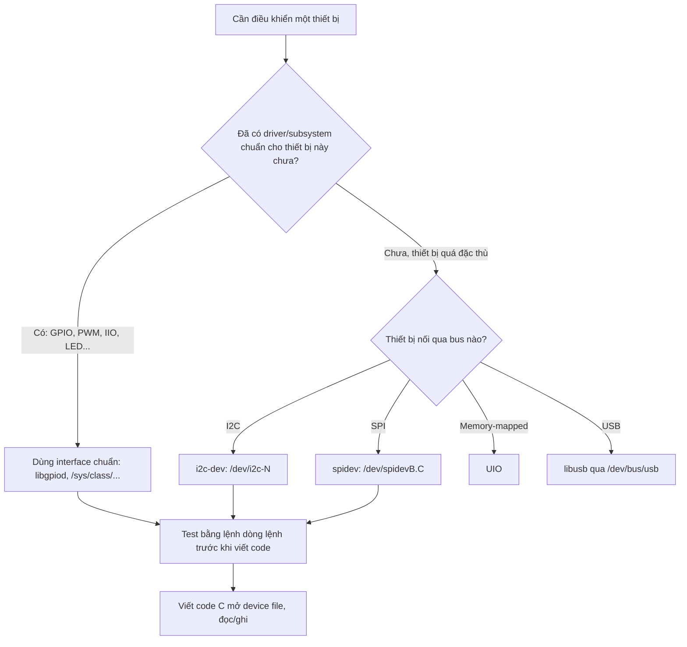

# Truy cập phần cứng từ user space

!!! note "Mục tiêu"
    Sau bài này, dò được thiết bị trên bus I2C bằng `i2c-tools`, bật/tắt được một chân GPIO qua
    `libgpiod` thay cho interface `/sys/class/gpio` cũ, và có sẵn khung code C dùng `i2c-dev` để
    tự điền phần đọc cảm biến I2C thật của mình vào.

## Chuẩn bị

- Phần cứng: board có ít nhất một chân GPIO nối LED/nút bấm, và một cảm biến I2C bất kỳ với địa
  chỉ 7-bit đã biết (ví dụ `0x76`) — [ĐIỀN: board + cảm biến cụ thể]
- Đã cài/build trước đó: root filesystem có `i2c-tools` và `libgpiod` (kèm các lệnh `gpiodetect`,
  `gpioget`, `gpioset`), toolchain cross-compile nếu build code C trên máy host — xem
  [Toolchain](toolchain.md), [Root filesystem](rootfs.md)
- Khái niệm nên đọc trước: [Device Tree](device-tree.md) — node I2C/GPIO trong `.dts` quyết định
  bus nào, địa chỉ nào, chân nào sẽ xuất hiện trong `/dev`

## Sơ đồ luồng thao tác



## Các bước

### 1. Kiểm tra công cụ và device file có sẵn

```bash
which gpiodetect i2cdetect
ls /dev/gpiochip* /dev/i2c-*
```

Thiếu thì bật package `libgpiod` và `i2c-tools` trong cấu hình Buildroot/Yocto rồi build lại
rootfs — hai công cụ này thường không có sẵn trên image tối giản.

### 2. Dò thiết bị trên bus I2C

```bash
i2cdetect -y [ĐIỀN: số bus, vd 0]
```

Lệnh quét toàn bộ địa chỉ 7-bit trên bus, in ra bảng — ô nào có thiết bị trả lời hiện số hex, còn
lại là `--`. Đây là bước xác nhận cảm biến đã lên bus và đúng địa chỉ, trước khi động vào code.

### 3. Điều khiển GPIO qua libgpiod

```bash
gpiodetect                        # liệt kê các gpiochip trong hệ thống
gpioinfo gpiochip0                # xem tên, hướng, trạng thái từng đường GPIO trên chip đó
gpioset gpiochip0 17=1            # đặt mức cao cho GPIO offset 17
gpioget gpiochip0 17              # đọc lại mức hiện tại
```

`libgpiod` thao tác qua `/dev/gpiochipX`, thay cho interface cũ ở `/sys/class/gpio` — interface đó
đã deprecated vì hai lý do: GPIO còn ở trạng thái exported nếu process dùng nó crash giữa chừng, và
số GPIO phải tự tính, không ổn định giữa các board. Gọi từ code C thì link thư viện `libgpiod`
thay vì tự mở file trong `/sys/class/gpio/export`.

### 4. Đọc thử một thanh ghi cảm biến bằng i2cget

```bash
i2cget -y [ĐIỀN: số bus] [ĐIỀN: địa chỉ cảm biến, vd 0x76] [ĐIỀN: địa chỉ thanh ghi, vd 0xD0]
```

Đọc ra đúng giá trị datasheet ghi (thường thanh ghi ID trả về mã chip cố định) nghĩa là địa chỉ và
đấu nối đều ổn — rẻ hơn nhiều so với debug thẳng trong code C.

### 5. Đọc cảm biến qua i2c-dev trong code C

```c
#include <fcntl.h>
#include <unistd.h>
#include <stdint.h>
#include <sys/ioctl.h>
#include <linux/i2c-dev.h>

int main(void)
{
    // TODO: thay bằng bus thật, ví dụ "/dev/i2c-1"
    int fd = open("/dev/i2c-[ĐIỀN]", O_RDWR);
    if (fd < 0)
        return -1;

    // Gán địa chỉ slave 7-bit cho fd — bắt buộc trước khi read()/write()
    if (ioctl(fd, I2C_SLAVE, [ĐIỀN: địa chỉ cảm biến, vd 0x76]) < 0)
        return -1;

    // TODO: điền đúng thanh ghi và số byte cần đọc theo datasheet cảm biến thật
    uint8_t reg = [ĐIỀN: địa chỉ thanh ghi];
    uint8_t data[/* ĐIỀN: số byte cần đọc */];

    write(fd, &reg, 1);
    read(fd, data, sizeof(data));

    // TODO: parse data[] theo công thức chuyển đổi của cảm biến (xem datasheet)

    close(fd);
    return 0;
}
```

`i2c-dev` là interface generic: không cần kernel driver riêng cho từng loại cảm biến, nhưng đổi
lại ứng dụng phải tự lo giao thức I2C ở mức thanh ghi. Đúng như slide Bootlin lưu ý, cách này chỉ
nên dùng cho thiết bị không có driver kernel nào phù hợp — kernel không biết gì về cảm biến đang bị
ứng dụng "chiếm" theo cách này, nên driver khác (nếu có) không thể dùng chung thiết bị đó.

## Kiểm tra kết quả

```
$ i2cdetect -y 0
     0  1  2  3  4  5  6  7  8  9  a  b  c  d  e  f
00:          -- -- -- -- -- -- -- -- -- -- -- -- --
70: -- -- -- -- -- -- 76 -- -- -- -- -- -- -- -- --

$ gpioget gpiochip0 17
1
```

!!! tip "Chèn ảnh thật của mình"
    Screenshot output `i2cdetect`/`gpioget` thật, hoặc log console khi chương trình C đọc cảm
    biến ra đúng giá trị — đặt vào `img/` cùng thư mục, chèn ``.

## Debug khi lỗi

!!! warning "`/dev/i2c-*` hoặc `/dev/gpiochip*`: Permission denied"
    Mặc định các device file này chỉ `root` hoặc group cụ thể (`i2c`, `gpio`) truy cập được.
    Dùng `sudo` để test nhanh, hoặc thêm rule `udev` gán quyền group cho user thường khi đóng gói
    vào sản phẩm thật.

!!! warning "`i2cget` hoặc code C trả lỗi Remote I/O error"
    Kernel trả lỗi này khi không thiết bị nào trả lời ở địa chỉ đó trên bus — sai địa chỉ 7-bit,
    dây SDA/SCL chưa nối, thiếu điện trở pull-up, hoặc cảm biến chưa cấp nguồn. Chạy lại
    `i2cdetect` để xác nhận địa chỉ trước khi nghi ngờ code.

## Mở rộng

- SPI có interface tương tự: `spidev`, device file `/dev/spidevB.C`, thao tác qua
  `ioctl(SPI_IOC_MESSAGE)` thay vì `read`/`write` thường, vì SPI trao đổi dữ liệu hai chiều đồng
  thời trên cùng một lần truyền.
- Thiết bị memory-mapped không nằm trên bus chuẩn nào dùng `UIO` (Userspace I/O) — kernel chỉ lo
  cấp phát vùng nhớ và ngắt, phần điều khiển thanh ghi hoàn toàn ở user space.
- Nhiều class thiết bị (LED, PWM, IIO) chỉ có interface qua `sysfs` (`/sys/class/...`), không có
  device file trong `/dev` — đọc/ghi file text thường thay vì gọi `ioctl`.

## Liên quan

- **Đọc trước:** [Device Tree](device-tree.md), [Kernel module](../02-kernel-driver/kernel-module.md)
- **Bước tiếp theo:** [Platform driver](../02-kernel-driver/platform-driver.md) — khi nào nên
  "tốt nghiệp" từ truy cập trực tiếp sang viết driver thật trong kernel

---
*Trang này dịch/phóng tác từ các phần "Kernel drivers" và "User-space interfaces to drivers"
trong khóa Embedded Linux System Development của Bootlin, giấy phép CC BY-SA 3.0. Bản gốc:
https://bootlin.com/training/embedded-linux.*
