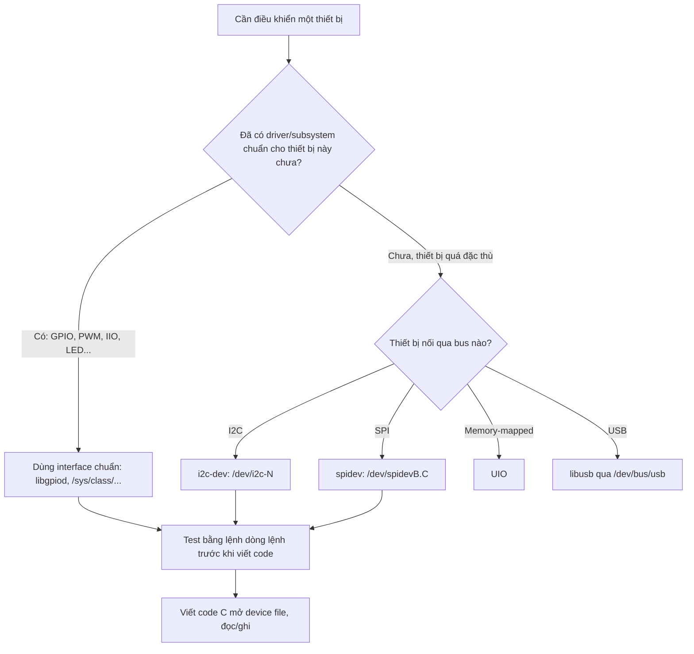
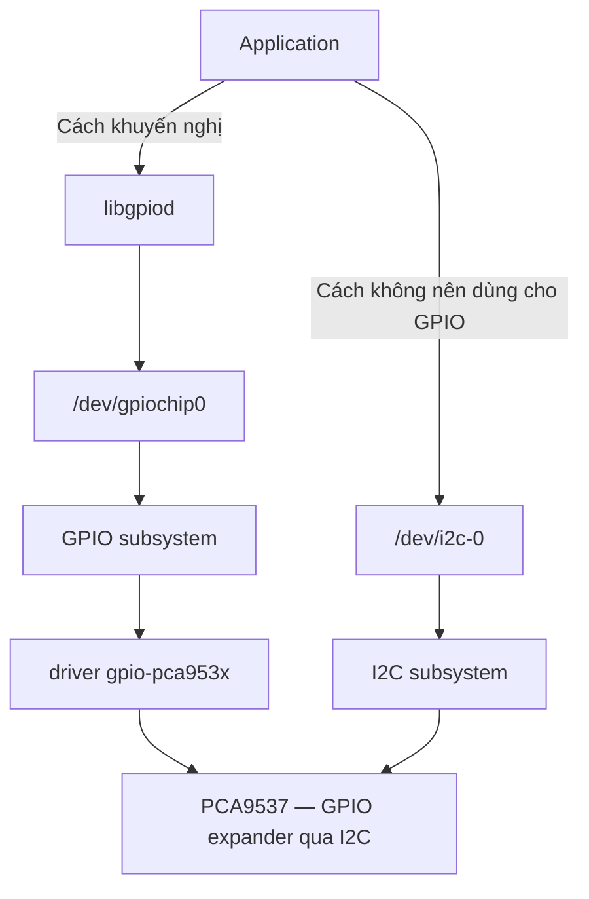

# Truy cập phần cứng từ user space

!!! note "Mục tiêu"
    Sau bài này, dò được thiết bị trên bus I2C bằng `i2c-tools`, bật/tắt được một chân GPIO qua
    `libgpiod` thay cho interface `/sys/class/gpio` cũ, và có sẵn khung code C dùng `i2c-dev` để
    tự điền phần đọc cảm biến I2C thật của mình vào.

## Chuẩn bị

- Phần cứng: board có ít nhất một chân GPIO nối LED/nút bấm, và một cảm biến I2C bất kỳ với địa
  chỉ 7-bit đã biết (ví dụ `0x76`) — [ĐIỀN: board + cảm biến cụ thể]
- Đã cài/build trước đó: root filesystem có `i2c-tools` và `libgpiod` (kèm các lệnh `gpiodetect`,
  `gpioget`, `gpioset`), toolchain cross-compile nếu build code C trên máy host — xem
  [Toolchain](toolchain.md), [Root filesystem](rootfs.md)
- Khái niệm nên đọc trước: [Device Tree](device-tree.md) — node I2C/GPIO trong `.dts` quyết định
  bus nào, địa chỉ nào, chân nào sẽ xuất hiện trong `/dev`

## Sơ đồ luồng thao tác

Giữa application và phần cứng thật có nhiều tầng nối tiếp nhau: **bus controller driver** (điều
khiển controller I2C/SPI vật lý trên SoC) → **bus subsystem** (API chung cho mọi driver dùng cùng
loại bus) → **device driver** (biết nói đúng "ngôn ngữ" của một chip cụ thể) → **driver subsystem**
(gộp mọi driver cùng lớp thiết bị — mọi GPIO controller, bất kể chip nào — thành một interface
user-space duy nhất). Nhờ tầng cuối này mà `libgpiod` viết một lần dùng được cho mọi board có GPIO
controller khác nhau, và một driver khác trong kernel (ví dụ driver cần toggle chân reset) cũng gọi
chung được subsystem đó — đây là lý do node đầu tiên trong sơ đồ dưới hỏi "đã có driver/subsystem
chuẩn chưa" trước khi nghĩ tới việc tự ioctl thẳng qua i2c-dev/spidev.



### So sánh trực quan: cùng một GPIO expander, hai cách truy cập



Cùng một chip PCA9537, đi qua GPIO subsystem + `libgpiod` là cách khuyến nghị vì driver
`gpio-pca953x` đã tồn tại sẵn trong kernel; tự mở `/dev/i2c-0` rồi ioctl thẳng để bật/tắt chân GPIO
là cách **không nên dùng** — kernel không biết gì về việc ứng dụng đang "chiếm" GPIO này, driver
khác (và cả `libgpiod`) sẽ không dùng chung thiết bị đó được nữa. i2c-dev chỉ nên dùng cho thiết
bị chưa có driver kernel nào phù hợp, như cảm biến đo ở bước 6.

## Các bước

### 1. Kiểm tra đã có driver kernel chuẩn cho thiết bị chưa

```bash
# Thiết bị đã có driver kernel bind vào chưa? Xem symlink `driver` trong sysfs
ls -l /sys/bus/i2c/devices/[ĐIỀN: địa chỉ, vd 0-0076]/driver

# Chưa chắc kernel có driver nào hỗ trợ chip này? Grep thẳng trong kernel source
git grep -i [ĐIỀN: tên chip cảm biến/GPIO expander] -- drivers/
```

Nếu `driver` đã trỏ tới một thư mục trong `/sys/bus/i2c/drivers/`, nghĩa là kernel đang giữ thiết
bị này bằng driver — dùng interface chuẩn của driver đó (sysfs class, IIO, GPIO subsystem...) thay
vì mở lại bằng i2c-dev, vì `ioctl(fd, I2C_SLAVE, ...)` sẽ trả lỗi (thiết bị đã bận). Nếu chưa có
driver, `git grep` là cách tra nhanh nhất — ví dụ thật: `git grep -i max7313` trong kernel source
ra ngay `drivers/gpio/gpio-pca953x.c`, một file tên nghe như chỉ hỗ trợ họ PCA953x nhưng thật ra hỗ
trợ luôn MAX7313 và nhiều chip khác; đọc tiếp `drivers/gpio/Makefile` để biết cần bật
`CONFIG_GPIO_PCA953X`. Ưu tiên driver đã lên **upstream** (được cộng đồng kernel review) hơn driver
**out-of-tree** do vendor cung cấp riêng — loại sau thường thiếu review kỹ, dễ hỏng khi lên kernel
version mới.

### 2. Kiểm tra công cụ và device file có sẵn

```bash
which gpiodetect i2cdetect
ls -l /dev/gpiochip* /dev/i2c-*
```

Thiếu thì bật package `libgpiod` và `i2c-tools` trong cấu hình Buildroot/Yocto rồi build lại
rootfs — hai công cụ này thường không có sẵn trên image tối giản.

Cột đầu của `ls -l` (ví dụ `crw-rw---- 1 root i2c 89, 0`) đáng chú ý hai chỗ: ký tự `c` nghĩa là
**character device** — đọc/ghi như một dòng byte, khác **block device** kiểu `/dev/mmcblk0` thao
tác theo khối cố định; và cặp số `89, 0` là **major**/**minor** — hai số kernel dùng nội bộ để định
danh chính xác thiết bị, không cần nhớ số cụ thể nhưng thấy chúng đổi khác thường (ví dụ major đổi
sau khi update kernel) là dấu hiệu driver hoặc thứ tự probe đã thay đổi.

### 3. Dò thiết bị trên bus I2C

```bash
i2cdetect -y [ĐIỀN: số bus, vd 0]
```

Lệnh quét toàn bộ địa chỉ 7-bit trên bus, in ra bảng — ô nào có thiết bị trả lời hiện số hex, còn
lại là `--`. Đây là bước xác nhận cảm biến đã lên bus và đúng địa chỉ, trước khi động vào code.

### 4. Điều khiển GPIO qua libgpiod

```bash
gpiodetect                        # liệt kê các gpiochip trong hệ thống
gpioinfo gpiochip0                # xem tên, hướng, trạng thái từng đường GPIO trên chip đó
gpioset gpiochip0 17=1            # đặt mức cao cho GPIO offset 17
gpioget gpiochip0 17              # đọc lại mức hiện tại
```

`libgpiod` thao tác qua `/dev/gpiochipX`, thay cho interface cũ ở `/sys/class/gpio` — interface đó
đã deprecated vì hai lý do: GPIO còn ở trạng thái exported nếu process dùng nó crash giữa chừng, và
số GPIO phải tự tính, không ổn định giữa các board. Gọi từ code C thì link thư viện `libgpiod`
thay vì tự mở file trong `/sys/class/gpio/export`.

Đánh đổi cần biết: `/sys/class/gpio` tuy deprecated nhưng không cần cài thêm gì — thao tác được
bằng `echo`/`cat` thuần shell, kể cả trên rootfs tối giản chưa kịp thêm package nào. `libgpiod`
(cả CLI lẫn thư viện) phải có sẵn trong rootfs từ trước — trên hệ thống resource hạn chế chưa
cross-compile kịp `libgpiod`, đây là lý do nhiều hướng dẫn cũ trên mạng vẫn chỉ cách dùng
`/sys/class/gpio`.

### 5. Đọc thử một thanh ghi cảm biến bằng i2cget

```bash
i2cget -y [ĐIỀN: số bus] [ĐIỀN: địa chỉ cảm biến, vd 0x76] [ĐIỀN: địa chỉ thanh ghi, vd 0xD0]
```

Đọc ra đúng giá trị datasheet ghi (thường thanh ghi ID trả về mã chip cố định) nghĩa là địa chỉ và
đấu nối đều ổn — rẻ hơn nhiều so với debug thẳng trong code C.

### 6. Đọc cảm biến qua i2c-dev trong code C

Cấu trúc dưới đây không có gì riêng của I2C — trong Linux gần như mọi đối tượng hệ thống, kể cả
thiết bị phần cứng, đều thao tác qua đúng khuôn `open` → (`ioctl` nếu cần cấu hình) → `read`/`write`
→ `close` giống hệt một file thường. `spidev` hay bất kỳ interface nào khác trong `/dev` cũng theo
đúng khuôn này, chỉ khác `ioctl` nào cần gọi và định dạng dữ liệu trao đổi.

```c
#include <fcntl.h>
#include <unistd.h>
#include <stdint.h>
#include <sys/ioctl.h>
#include <linux/i2c-dev.h>

int main(void)
{
    // TODO: thay bằng bus thật, ví dụ "/dev/i2c-1"
    int fd = open("/dev/i2c-[ĐIỀN]", O_RDWR);
    if (fd < 0)
        return -1;

    // Gán địa chỉ slave 7-bit cho fd — bắt buộc trước khi read()/write()
    if (ioctl(fd, I2C_SLAVE, [ĐIỀN: địa chỉ cảm biến, vd 0x76]) < 0)
        return -1;

    // TODO: điền đúng thanh ghi và số byte cần đọc theo datasheet cảm biến thật
    uint8_t reg = [ĐIỀN: địa chỉ thanh ghi];
    uint8_t data[/* ĐIỀN: số byte cần đọc */];

    write(fd, &reg, 1);
    read(fd, data, sizeof(data));

    // TODO: parse data[] theo công thức chuyển đổi của cảm biến (xem datasheet)

    close(fd);
    return 0;
}
```

`i2c-dev` là interface generic: không cần kernel driver riêng cho từng loại cảm biến, nhưng đổi
lại ứng dụng phải tự lo giao thức I2C ở mức thanh ghi. Đúng như slide Bootlin lưu ý, cách này chỉ
nên dùng cho thiết bị không có driver kernel nào phù hợp — kernel không biết gì về cảm biến đang bị
ứng dụng "chiếm" theo cách này, nên driver khác (nếu có) không thể dùng chung thiết bị đó. Hai ví
dụ cụ thể slide đưa ra để thấy hậu quả rõ hơn: viết driver màn hình cảm ứng (touchscreen) kiểu
i2c-dev thì stack đồ hoạ chuẩn của Linux không nhận ra thiết bị này là touchscreen; viết driver
mạng kiểu này thì gửi/nhận packet thô được, nhưng mất toàn bộ networking stack của kernel (IP, TCP,
UDP), và không ứng dụng networking nào dùng được thiết bị.

## Kiểm tra kết quả

```
$ i2cdetect -y 0
     0  1  2  3  4  5  6  7  8  9  a  b  c  d  e  f
00:          -- -- -- -- -- -- -- -- -- -- -- -- --
70: -- -- -- -- -- -- 76 -- -- -- -- -- -- -- -- --

$ gpioget gpiochip0 17
1
```

!!! tip "Chèn ảnh thật của mình"
    Screenshot output `i2cdetect`/`gpioget` thật, hoặc log console khi chương trình C đọc cảm
    biến ra đúng giá trị — đặt vào `img/` cùng thư mục, chèn ``.

## Debug khi lỗi

!!! warning "`/dev/i2c-*` hoặc `/dev/gpiochip*`: Permission denied"
    Mặc định các device file này chỉ `root` hoặc group cụ thể (`i2c`, `gpio`) truy cập được. Dùng
    `sudo` để test nhanh, hoặc gán quyền group cho user thường khi đóng gói vào sản phẩm thật —
    trên desktop Linux thường thêm rule `udev` (`/etc/udev/rules.d`), còn rootfs kiểu BusyBox (xem
    [Root filesystem](rootfs.md)) thường chạy `mdev` chứ không phải `udev` đầy đủ, chỉnh quyền qua
    `/etc/mdev.conf` thay vì rule udev.

!!! warning "`ls /dev/i2c-*` hoặc `/dev/gpiochip*` ra rỗng, dù driver bus đã enable trong kernel"
    Khác với lỗi permission ở trên — trường hợp này device file chưa từng được tạo ra. `devtmpfs`
    lẽ ra tự tạo/xoá các file này khi mount ở `/dev` (bật `CONFIG_DEVTMPFS_MOUNT` để kernel tự mount
    lúc boot); nếu rootfs không có `devtmpfs` và cũng không chạy `udev`/`mdev`, phải tự tạo bằng
    `mknod` — cách làm cũ trước Linux 2.6.32, hiếm gặp trên hệ thống hiện đại nhưng vẫn có thể gặp
    trên rootfs tối giản tự dựng tay.

!!! warning "`i2cget` hoặc code C trả lỗi Remote I/O error"
    Kernel trả lỗi này khi không thiết bị nào trả lời ở địa chỉ đó trên bus — sai địa chỉ 7-bit,
    dây SDA/SCL chưa nối, thiếu điện trở pull-up, hoặc cảm biến chưa cấp nguồn. Chạy lại
    `i2cdetect` để xác nhận địa chỉ trước khi nghi ngờ code.

!!! tip "Xem GPIO nào đang bị ai giữ"
    `debugfs` (thường mount ở `/sys/kernel/debug`) cho xem trực tiếp trạng thái driver đang giữ:
    `cat /sys/kernel/debug/gpio` liệt kê từng GPIO đang được request bởi tên nào — tiện để biết một
    GPIO có đang bị driver kernel khác giữ trước khi thử `gpioset`. Tương tự có
    `/sys/kernel/debug/pinctrl` cho debug pin-mux.

## Mở rộng

- SPI có interface tương tự: `spidev`, device file `/dev/spidevB.C`, thao tác qua
  `ioctl(SPI_IOC_MESSAGE)` thay vì `read`/`write` thường, vì SPI trao đổi dữ liệu hai chiều đồng
  thời trên cùng một lần truyền.
- Thiết bị memory-mapped không nằm trên bus chuẩn nào dùng `UIO` (Userspace I/O) — kernel chỉ lo
  cấp phát vùng nhớ và ngắt, phần điều khiển thanh ghi hoàn toàn ở user space.
- PCI dùng entry trong `sysfs` thay vì device file riêng — không phổ biến trên board embedded nhỏ
  nhưng gặp trên các SoC có khe PCIe (card mạng, NVMe rời).
- Ba nhóm interface chính tới phần cứng trong Linux: device node trong `/dev`, entry trong `sysfs`,
  và **network socket** — bài này tập trung hai nhóm đầu vì đúng chủ đề GPIO/I2C; thiết bị mạng
  (Ethernet, WiFi) lại đi qua API socket chuẩn của hệ điều hành, không có file tương ứng trong
  `/dev`.
- Nhiều class thiết bị (LED, PWM, IIO) chỉ có interface qua `sysfs` (`/sys/class/leds`,
  `/sys/class/pwm`, `/sys/bus/iio`), không có device file trong `/dev` — đọc/ghi file text thường
  thay vì gọi `ioctl`. Bản thân `sysfs` được tổ chức có hệ thống chứ không phải vài file lẻ tẻ:
  `block/` (symlink tới block device), `bus/` (theo loại bus), `class/` (theo lớp thiết bị),
  `dev/` (symlink theo major/minor), `devices/` (mọi thiết bị trong hệ thống), và
  `firmware/devicetree/` — bản sao dạng file/thư mục của toàn bộ Device Tree đang chạy.
- Ngoài GPIO/I2C, kernel có rất nhiều subsystem khác theo cùng triết lý "một interface chuẩn cho
  cả lớp thiết bị": `MTD` cho flash memory, `DRM` cho display controller/GPU, `ALSA` cho âm thanh,
  `V4L` (Video4Linux) cho camera, `IIO` cho ADC/DAC/cảm biến đo lường, `RTC` cho đồng hồ thời gian
  thực, `hwmon` cho cảm biến giám sát phần cứng (nhiệt độ, điện áp), `remoteproc` cho vi xử lý phụ,
  và mạng cho Ethernet/WiFi/CAN — thấy một class thiết bị mới, việc đầu tiên nên làm là tra xem đã
  có subsystem chuẩn nào cho nó chưa, trước khi nghĩ tới i2c-dev/spidev/UIO.

## Liên quan

- **Đọc trước:** [Device Tree](device-tree.md), [Kernel module](../02-kernel-driver/kernel-module.md)
- **Bước tiếp theo:** [Platform driver](../02-kernel-driver/platform-driver.md) — khi nào nên
  "tốt nghiệp" từ truy cập trực tiếp sang viết driver thật trong kernel

---
*Trang này dịch/phóng tác từ các phần "Kernel drivers" và "User-space interfaces to drivers"
trong khóa Embedded Linux System Development của Bootlin, giấy phép CC BY-SA 3.0. Bản gốc:
https://bootlin.com/training/embedded-linux.*
