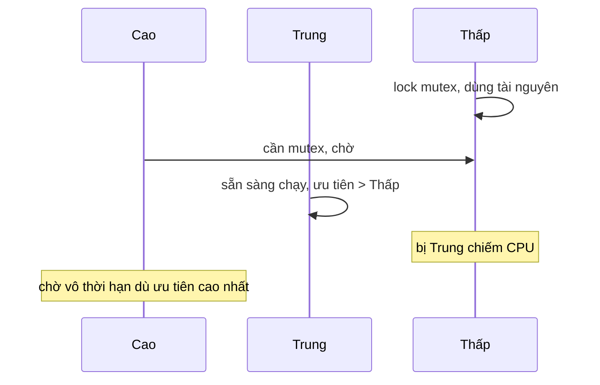

# Đồng bộ hóa trong RTOS: priority inversion, mutex vs semaphore

!!! note "Tóm tắt"
    Vì sao một task ưu tiên cao đôi khi bị "treo" vô lý chờ một task ưu tiên thấp, và tại sao
    mutex với semaphore — trông giống nhau — lại giải quyết hai bài toán khác hẳn nhau.

## Vì sao cần biết cái này

Bug loại này không crash, không báo lỗi rõ ràng — chỉ là task quan trọng nhất hệ thống bỗng dưng
phản hồi trễ bất thường, xảy ra không đều, rất khó tái hiện để debug. Hiểu cơ chế đứng sau nó là
cách duy nhất để nhận ra ngay khi nhìn thấy triệu chứng, thay vì đoán mò.

## Priority inversion

Giả sử ba task, ưu tiên Cao > Trung > Thấp, chia sẻ một tài nguyên bảo vệ bằng mutex:

1. Task **Thấp** chạy trước, lock mutex để dùng tài nguyên chung
2. Task **Cao** được kích hoạt, cần cùng tài nguyên đó — phải chờ Thấp nhả mutex
3. Trong lúc Thấp đang giữ mutex, task **Trung** (không liên quan gì đến tài nguyên này) sẵn sàng
   chạy — vì ưu tiên cao hơn Thấp, scheduler cho Trung chạy trước, đẩy Thấp ra khỏi CPU
4. Kết quả: Cao phải chờ Thấp, nhưng Thấp lại đang bị Trung chiếm CPU — task ưu tiên **cao nhất
   hệ thống** bị chặn gián tiếp bởi task **ưu tiên thấp nhất**, trong khi lẽ ra Trung không nên
   ảnh hưởng gì đến Cao cả

Đây không phải trường hợp lý thuyết hiếm gặp — sự cố nổi tiếng nhất là tàu thăm dò Mars Pathfinder
năm 1997, hệ thống tự reset lặp lại ngoài không gian chính vì priority inversion giữa các task
chia sẻ bus dữ liệu.

## Priority inheritance — cách RTOS hiện đại xử lý

Giải pháp: khi task ưu tiên cao đang chờ một mutex mà task ưu tiên thấp đang giữ, **tạm thời nâng
ưu tiên của task thấp lên bằng task cao đang chờ**, cho đến khi nó nhả mutex. Trong ví dụ trên,
lúc Cao bắt đầu chờ, Thấp được nâng tạm thời lên ngang Cao — nên Trung không còn chen ngang được
nữa, Thấp chạy tiếp và nhả mutex nhanh nhất có thể, sau đó tự động hạ lại ưu tiên gốc.

FreeRTOS bật cơ chế này qua mutex chuẩn (`xSemaphoreCreateMutex`) chứ không phải với binary
semaphore thường — đây chính là khác biệt cốt lõi giữa hai loại bên dưới.

## Mutex vs binary semaphore — nhìn giống nhau, dùng cho việc khác nhau

Cả hai đều chỉ có 2 trạng thái (khóa/mở, hoặc 0/1), API dùng cũng gần giống nhau, nhưng bản chất
giải hai bài toán khác nhau:

| | Mutex | Binary semaphore |
|---|---|---|
| Mục đích | Bảo vệ tài nguyên dùng chung (mutual exclusion) | Báo hiệu giữa hai bên (signaling) |
| Ownership | Có — chỉ task đã lock mới được unlock | Không — task nào cũng post/take được |
| Priority inheritance | Có | Không |
| Ai dùng | Task ↔ task, cùng cấp | Thường ISR → task (báo "dữ liệu đã sẵn sàng") |

Nhầm lẫn phổ biến nhất: dùng binary semaphore để bảo vệ tài nguyên chung. Vì semaphore không có
khái niệm "chủ sở hữu", một task có thể vô tình unlock semaphore mà task khác đang lock — mutex
chặn được lỗi này bằng ownership, semaphore thì không.

## Counting semaphore

Biến thể thứ ba: đếm số lượng tài nguyên khả dụng thay vì chỉ khóa/mở nhị phân. Ví dụ điển hình —
một pool có N buffer cố định: mỗi lần task lấy một buffer thì đếm giảm 1 (`take`), trả lại thì
tăng 1 (`give`); khi đếm về 0, task tiếp theo xin buffer sẽ tự động chờ đến khi có buffer được trả.

## Liên quan

- **Đọc trước:** [Kiến trúc FreeRTOS](freertos-kien-truc.md), [Context switch](context-switch.md)
- **Đọc tiếp:** `mini-rtos.md` — áp dụng priority inheritance khi tự viết mutex cho mini-RTOS
- **Tự kiểm tra:** câu 10–11 trong [28 câu tự kiểm tra](../phu-luc/28-cau-tu-kiem-tra.md)

---
*Khái niệm phổ biến trong tài liệu RTOS nói chung — tham khảo thêm: Mastering the FreeRTOS
Real Time Kernel (freertos.org, miễn phí).*
