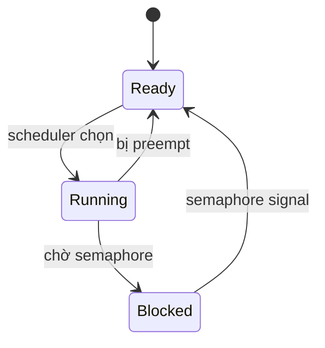

<!--
KHUNG TRANG KHÁI NIỆM
Dùng cho: trang giải thích một ý tưởng/cơ chế (vd: "spinlock vs mutex", "priority inversion",
"device tree là gì"). Không phải hướng dẫn thao tác từng bước — dùng khung trang thực hành cho việc đó.

Xóa toàn bộ comment HTML này khi tạo trang thật. Các mục có "(tùy chọn)" có thể bỏ nếu không cần.
-->

# {Tên khái niệm}

!!! note "Tóm tắt"
    1-2 câu: trang này trả lời câu hỏi gì. Đọc xong dòng này là biết có cần đọc tiếp không.

## Vì sao cần biết cái này

Bối cảnh thực tế khiến khái niệm này quan trọng — một tình huống cụ thể sẽ vướng nếu không hiểu.
Không mở đầu bằng định nghĩa khô khan; mở đầu bằng vấn đề.

## {Giải thích chính}

Nội dung cốt lõi. Chia nhiều heading `##` nếu khái niệm có nhiều phần.
Thuật ngữ kỹ thuật giữ tiếng Anh (xem quy định văn phong trong CLAUDE.md).

!!! tip "Mẹo"
    Dùng cho lưu ý giúp nhớ nhanh hoặc cách tiếp cận thực dụng — không bắt buộc mỗi trang phải có.

!!! warning "Cẩn thận"
    Dùng cho ngộ nhận dễ mắc hoặc hậu quả nếu làm sai — vd race condition, undefined behavior.

## Biểu đồ (tùy chọn)

Chỉ thêm khi khái niệm có cấu trúc **quan hệ/trình tự/phân cấp** mà chữ khó diễn đạt gọn
(vd: cây device tree, trạng thái task, luồng gọi hàm). Nếu khái niệm chỉ là một định nghĩa
đơn giản, bỏ qua mục này — biểu đồ thừa còn gây rối hơn giúp ích.

Chọn loại phù hợp:
- Quan hệ phân cấp (device tree, cấu trúc struct lồng nhau) → `flowchart TD`
- Trình tự theo thời gian (interrupt handling, IPC giữa task) → `sequenceDiagram`
- Trạng thái chuyển đổi (task states: ready/running/blocked) → `stateDiagram-v2`



## Ví dụ

Code, waveform, hoặc số liệu đo được thực tế — ưu tiên ví dụ tự làm (từ board, từ project)
hơn ví dụ lý thuyết suông.

```c
// ví dụ code, có comment tiếng Việt
```

## Sai lầm thường gặp (tùy chọn)

Bug/ngộ nhận điển hình khi mới học khái niệm này. Chỉ thêm nếu thật sự có kinh nghiệm cụ thể,
không liệt kê chung chung.

## Liên quan

- **Đọc trước:** [{trang tiên quyết}](../đường-dẫn.md) — nếu khái niệm này phụ thuộc trang khác
- **Đọc tiếp:** [{trang liên quan}](../đường-dẫn.md)
- **Tự kiểm tra:** câu {số} trong [28 câu tự kiểm tra](../phu-luc/28-cau-tu-kiem-tra.md)

---
*{Block ghi công theo Luồng A, hoặc dòng "Tham khảo ý tưởng từ..." theo Luồng B — xem CLAUDE.md}*
