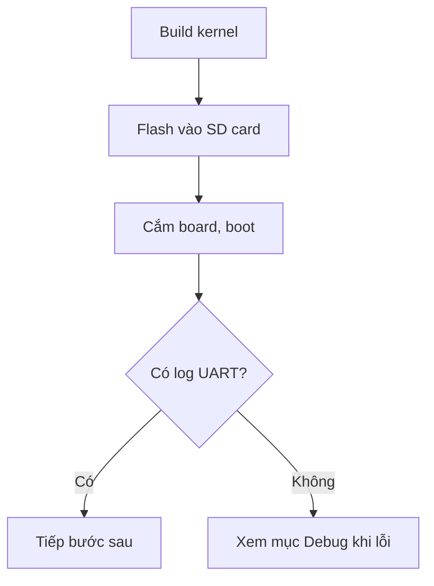

<!--
KHUNG TRANG THỰC HÀNH
Dùng cho: trang hướng dẫn làm một việc cụ thể (vd: "viết platform driver đầu tiên",
"build image bằng Yocto"). Mục tiêu là LÀM ĐƯỢC và TỰ KIỂM TRA được kết quả,
không phải giải thích lý thuyết — dùng khung trang khái niệm cho việc đó và link sang.

Xóa toàn bộ comment HTML này khi tạo trang thật.
-->

# {Tên bài thực hành}

!!! note "Mục tiêu"
    Sau bài này, bạn làm được gì cụ thể. Viết dưới dạng kết quả quan sát được
    (vd: "board in ra dmesg khi cắm cảm biến"), không viết dạng lý thuyết.

## Chuẩn bị

- Phần cứng: {board, cảm biến, dây...}
- Đã cài/build trước đó: {liệt kê, link tới trang trước nếu phụ thuộc}
- Khái niệm nên đọc trước: [{trang khái niệm liên quan}](../đường-dẫn.md)

## Sơ đồ luồng thao tác (tùy chọn)

Chỉ thêm nếu bài có nhiều bước phụ thuộc lẫn nhau hoặc có nhánh rẽ (làm A rồi mới B,
hoặc "nếu X thì làm Y khác"). Bài tuyến tính đơn giản thì bỏ qua, danh sách bước là đủ.



## Các bước

### 1. {Tên bước}

Giải thích ngắn + lệnh/code. Dùng code block có ngôn ngữ để syntax highlight đúng.

```bash
lệnh cụ thể
```

### 2. {Tên bước tiếp theo}

...

(Đánh số theo thứ tự thao tác thật, không gộp nhiều việc vào 1 bước.)

## Kiểm tra kết quả

Làm sao biết mình vừa làm đúng — output mong đợi cụ thể, không chỉ nói "chạy được".

```
$ dmesg | tail
[output mẫu]
```

## Debug khi lỗi (tùy chọn)

Lỗi hay gặp nhất ở bài này và cách sửa. Chỉ ghi lỗi đã thật sự gặp, không đoán trước.

!!! warning "Lỗi thường gặp"
    Mô tả lỗi cụ thể (thông báo lỗi, triệu chứng) + cách sửa. Một block cho mỗi lỗi
    nếu có nhiều loại, không gộp chung.

## Mở rộng (tùy chọn)

1-2 ý tưởng đào sâu thêm nếu còn thời gian — không bắt buộc để hiểu bài.

## Liên quan

- **Đọc trước:** [{trang tiên quyết}](../đường-dẫn.md)
- **Bước tiếp theo:** [{trang sau trong chuỗi}](../đường-dẫn.md)

---
*{Block ghi công theo Luồng A, hoặc dòng "Tham khảo ý tưởng từ..." theo Luồng B — xem CLAUDE.md}*
